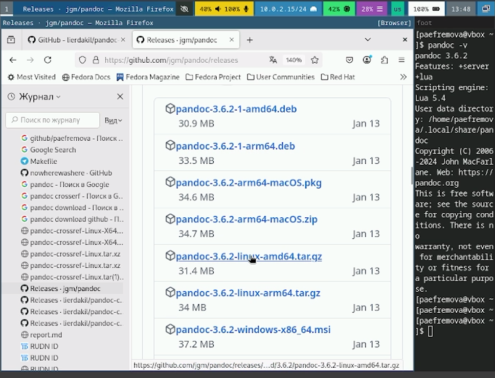

---
## Front matter
lang: ru-RU
title: Лабораторная работа №1
subtitle: Установка ОС Linux
author:
  - Ефремова Полина Александровна
institute:
  - Российский университет дружбы народов, Москва, Россия
 
date: 04 марта 2025

## i18n babel
babel-lang: russian
babel-otherlangs: english

## Formatting pdf
toc: false
toc-title: Содержание
slide_level: 2
aspectratio: 169
section-titles: true
theme: metropolis
header-includes:
 - \metroset{progressbar=frametitle,sectionpage=progressbar,numbering=fraction}
---

# Информация

## Докладчик

:::::::::::::: {.columns align=center}
::: {.column width="70%"}

  * Ефремова Полина Александровна 
  * студент группы НКАбд-02-24
  * ст.б №1132246726
  * Российский университет дружбы народов
  * [Почта](1132246726@pfur.ru)
  * <https://github.com/Paefremova/>

:::
::: {.column width="30%"}

:::
::::::::::::::

# Вводная часть

## Актуальность

- OC Linux достаточно востребована
- установка поможет более точно опять принцип работы данной системы
- работа с терминалом упрощает жизнь программисту 

## Объект и предмет исследования

- дистрибутив Linux Fedora-Sway-Live-x86_64-41-1.4.iso.в

## Цели и задачи

- Установка операционной системы

- Загрузка необходимых обновлений

- Настройка раскладки клавиатуры

- Установка ПО для создания документации

- Выполнение домашнего задания

## Материалы и методы

- исследование системы Linux

- практическое использование терминала

- Процессор `pandoc` для входного формата Markdown

# Выполнение лабораторной работы

## Установка операционной системы 

Скачиваю необходимое программное ПО 

{#fig:001 width=70%}

## Настройка виртуальной машины 

{#fig:002 width=70%}

## Подготовка к установке, ввод:

- языка
- места установки
- данных пользователя
- данных администратора

## Важно запомнить!  

После установки важно удалить контроллер IDE  

{#fig:009 width=70%}

## Обновления 

1. Устанавливаю средства разработки 

{#fig:010 width=70%}

##

2. Обновляю все пакеты 

{#fig:011 width=60%}

## Повышение комфорта работы 

1. Устанавливаю программы для удобсвта консоли 

{#fig:012 width=70%}

## Автоматическое обновление 

1. Установка ПО и запускаю таймер 

{#fig:013 width=70%}

## Отключение SELinux

1. Перехожу в /etc/selinux/config, открываю файл и меняю значение SELINUX=enforsing на SELINUX=permissive .

{#fig:014 width=50%}

## Найстрока раскладки клавиатуры 

2. Редактирование файла 00-keyboard.conf и перезапуск. 

{#fig:017 width=70%}

## Установка ПО для создания документации 

1. Устанавливаю дистрибутив TexLive 

{#fig:018 width=70%}

##

2. Скачиваю pandoc версии 3.6.2, pandoc-crossref для pandoc 3.6.2  

{#fig:019 width=55%}

##

*Перенос в папку bin только указанных ниже файлов!!!* 

{#fig:020 width=50%}

## Домашнее задание 

1. Ввожу dmesg и просматриваю вывод этой программы. Вижу, как запускается система. 

{#fig:021 width=70%}

## Получаю информацию о:

- *версии ядра*

{#fig:022 width=70%}

## Получаю информацию о:

- *частоте процессора* 

{#fig:023 width=70%}

## Получаю информацию о:

- *моделе процессора* 

{#fig:024 width=70%}

## Получаю информацию о:

- *об объеме доступной оперативной памяти* 

{#fig:025 width=70%}

## Получаю информацию о:

- *типе обнаруженного гипервизора* 

{#fig:026 width=70%}

## Получаю информацию о:

- *типе файловой системы корневого раздела* 

{#fig:027 width=70%}

## Получаю информацию о:

- *последовательности монтирования файловых систем*

{#fig:028 width=70%}

## Выводы

- улучение навыков установки дистрибутива ОС и необходимого для него ПО
- использование горячих клавиш - ускорение работы
- интернет ресурсы - помощь при установке 

## Литература 

[Лабораторная работа 1](https://esystem.rudn.ru/mod/page/view.php?id=1224368#orgf88e4c8)

[Основы командной строки Unix](https://esystem.rudn.ru/mod/page/view.php?id=1030497)

[Горячие клавиши терминала Linux - Академия Selectel](https://selectel.ru/blog/tutorials/linux-terminal-hotkeys/)

[Основы Linux (обзор с практическим уклоном) / Хабр](https://habr.com/ru/articles/655275/)

