---
## Front matter
lang: ru-RU
title: Лабораторная работа №2
subtitle: Первоначальна настройка git.
author:
  - Ефремова Полина Александровна
institute:
  - Российский университет дружбы народов, Москва, Россия
 
date: 06 марта 2025

## i18n babel
babel-lang: russian
babel-otherlangs: english

## Formatting pdf
toc: false
toc-title: Содержание
slide_level: 2
aspectratio: 169
section-titles: true
theme: metropolis
header-includes:
 - \metroset{progressbar=frametitle,sectionpage=progressbar,numbering=fraction}
---

# Информация

## Докладчик

:::::::::::::: {.columns align=center}
::: {.column width="70%"}

  * Ефремова Полина Александровна 
  * студент группы НКАбд-02-24
  * ст.б №1132246726
  * Российский университет дружбы народов
  * polinaefremova68890@gmail.com
  * <https://github.com/Paefremova/>

:::
::: {.column width="30%"}

:

:::
::::::::::::::

# Вводная часть

## Актуальность

- обеспечивание дополнительных, более гибких функциональных возможностей. 
- возможность отслеживания и разрешения конфликтов, которые могут возникнуть при работе нескольких человек над одним файлом

## Объект и предмет исследования 

- git и его первоначальная настройка 

## Цели и задачи 
        
- Установка программного обеспечения
- Базовая настройка git
- Создайте ключи ssh
- Создайте ключи pgp
- Настройка github
- Добавление PGP ключа в GitHub
- Настройка автоматических подписей коммитов git
- Шаблон для рабочего пространства

## Материалы и методы 

- установка, настройка и исследование элементов git 

# Выполнение лабораторной работы 

## Установка программного обеспечаения

1. С помощью команд dnf install gh и dnf install git-all устанавливаю необходимое обеспечение 

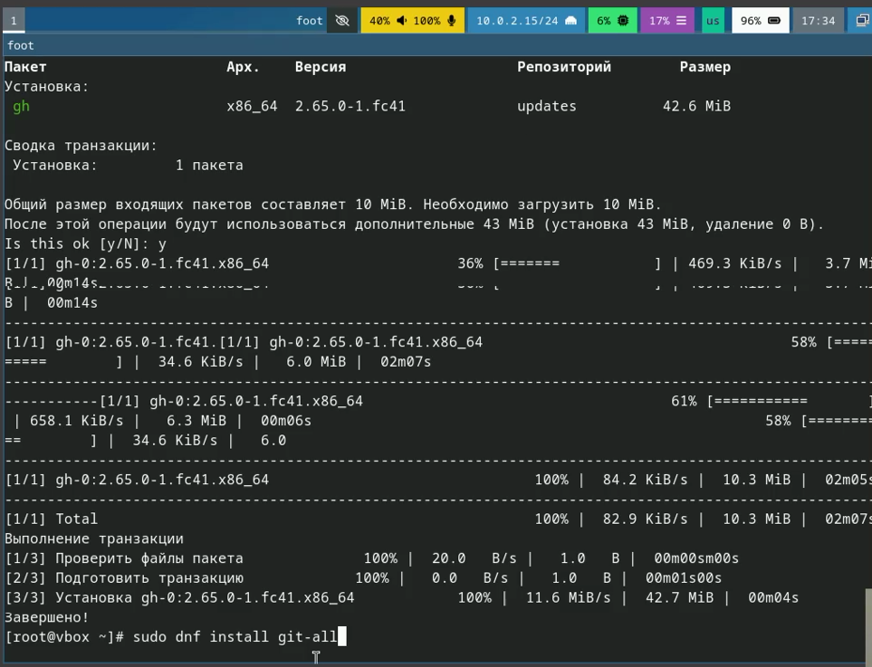{#fig:002 width=70%}

## Базовая настройка Git

1. Задаю имя и email владельца репозитория, настраиваю utf-8 в выводе сообщения git, 
задаю имя начальной ветки а также задаю параметры autocrlf и safecrlf. 

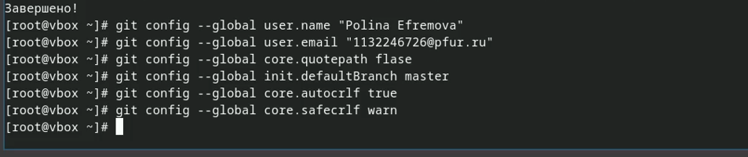{#fig:003 width=70%} 

## Создание ключа SSH

1. Создаю ключ по алгоритму 4096 

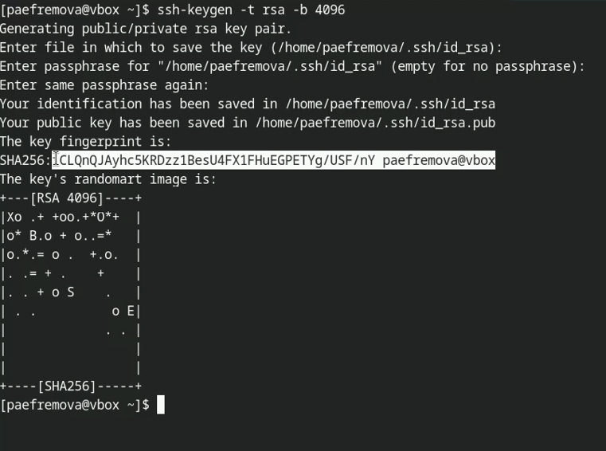{#fig:004 width=70%}

##

2. Создаю ключ по алгоритму ed25519 

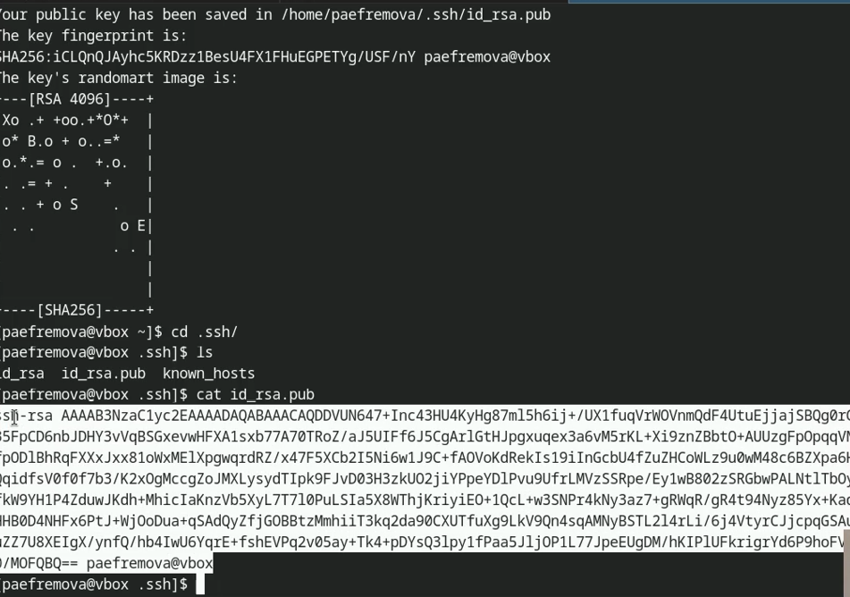{#fig:005 width=70%}

##

3. Добавляю скопированный SSH ключ на GitHub 

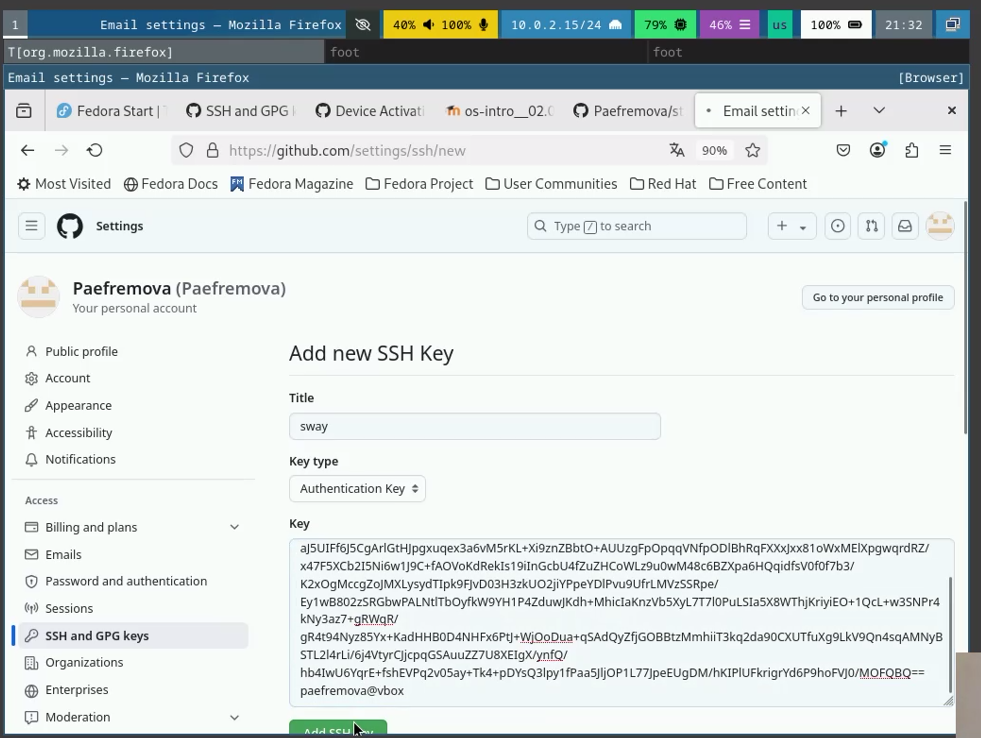{#fig:006 width=70%}

## Создание gpg ключа 

1. Генерирую gpg ключ 

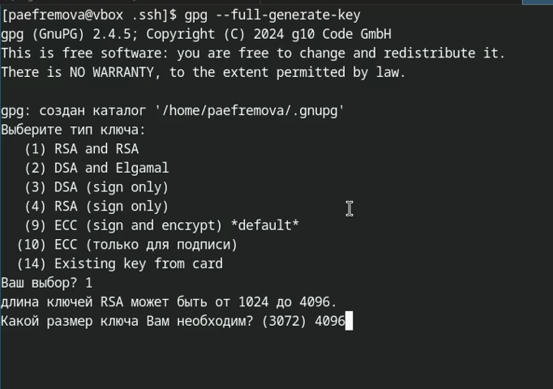{#fig:007 width=70%}

##

2. Настраиваю этот gpg ключ указанным способом 

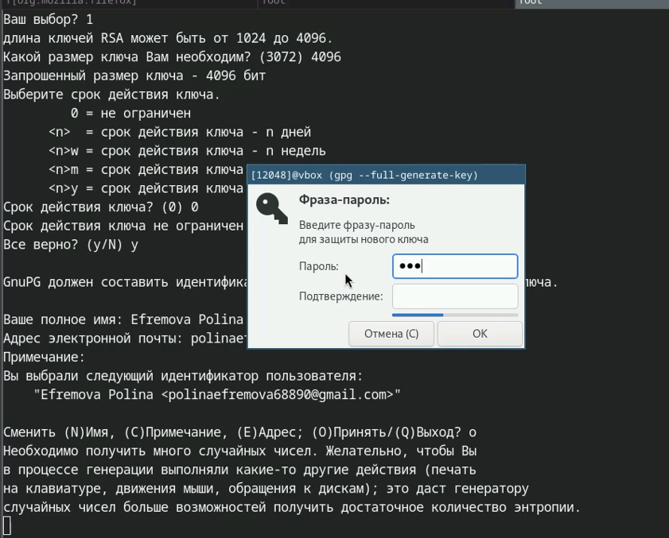{#fig:008 width=70%}

##

3. Вывожу список ключей и копирую отпечаток приватного ключа 

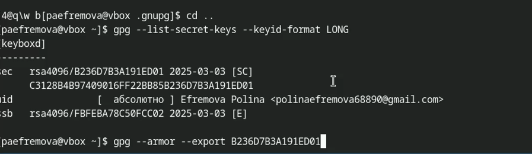{#fig:009 width=70%}

##

4. Копирую сгенерированный PGP ключ 

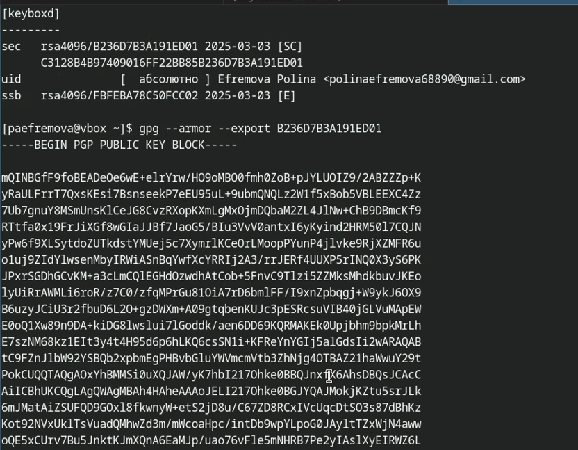{#fig:010 width=70%}

##

5. Добавляю ключ на Github 

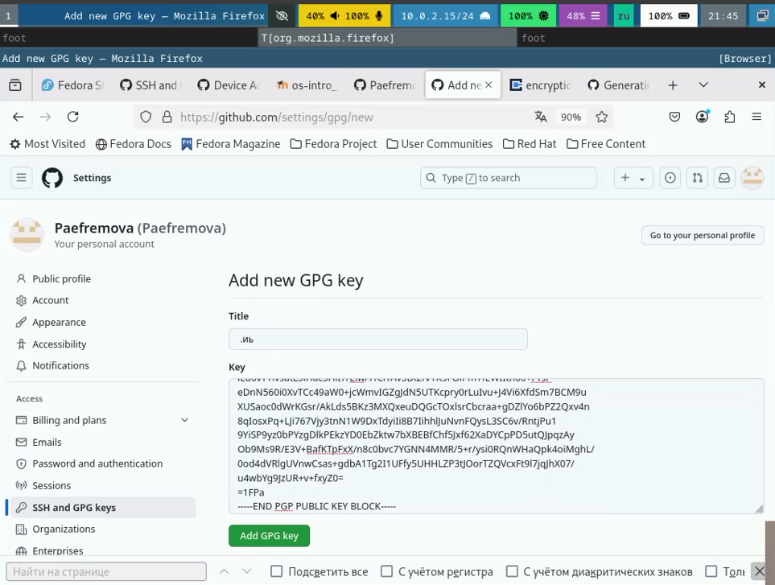{#fig:011 width=70%}

##

6. Авторизируюсь, отвечаю на контрольные вопросы 

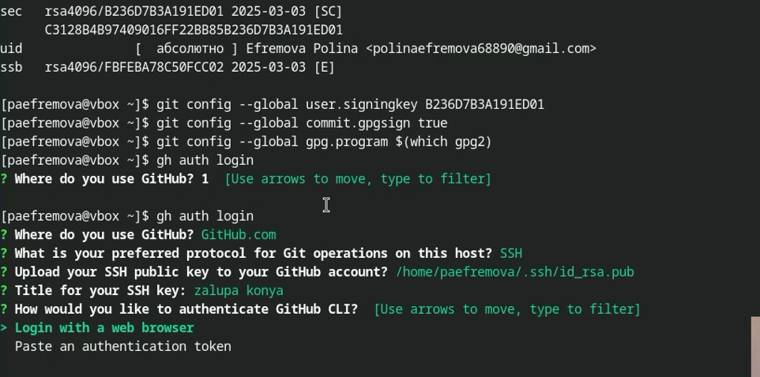{#fig:012 width=70%}

##

7. Ввожу код 

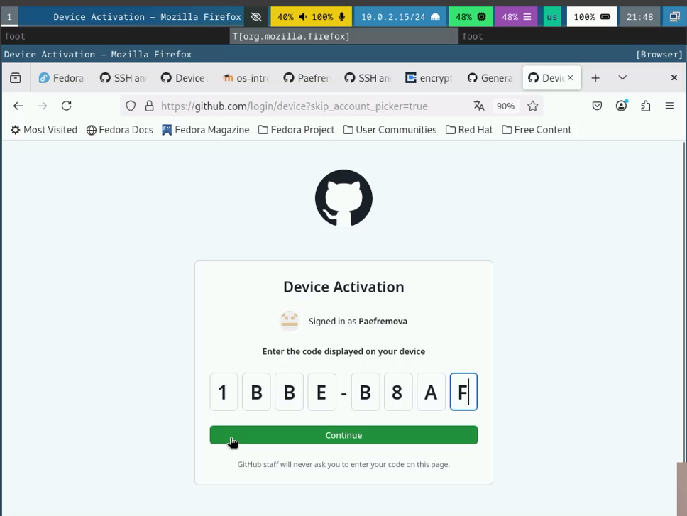{#fig:013 width=70%}

## Создание репозитория курса на основе шаблона 

1. Создаю репозиторий 

{#fig:014 width=70%}

##

2. Перехожу в него и копирую шаблон 

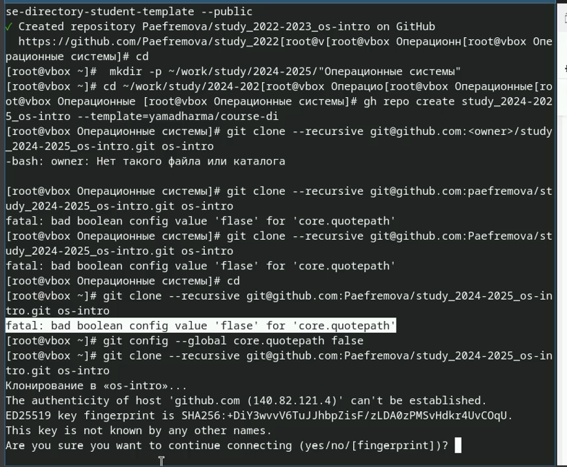{#fig:015 width=70%}

##

3. Перехожу в каталог курса 

{#fig:016 width=70%}

##

4. Создаю необходимые каталоги 

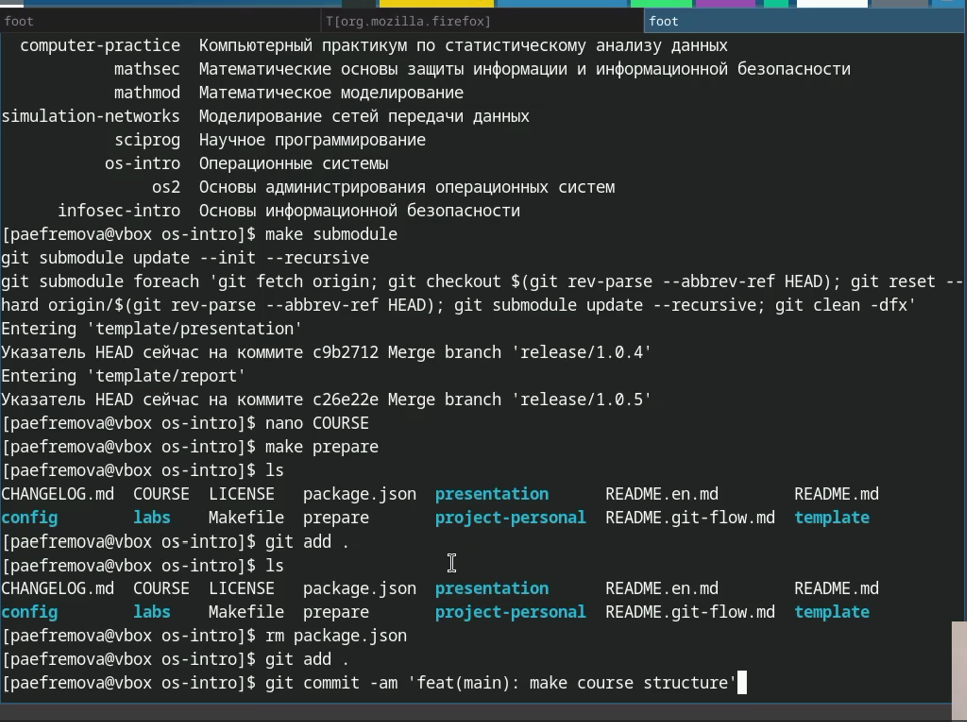{#fig:017 width=70%}

##

5. Отправляю файлы на сервер 

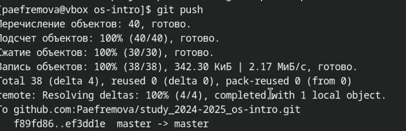{#fig:018 width=70%}

## Выводы

В заключение хочется отметить, что данная лабораторная работа позволила
мне научиться работать с системой Git. Я практиковала свои навыки в работе с
командной строкой, теперь уже связывая выполнимое с директориями GitHub. 

Кроме этого, я научилась работать с Markdown (вспмонила, опираясь на материалы из прошлого семестра в том числе) 

## Список литературы 

1. [Архитектура ЭВМ](https://esystem.rudn.ru/pluginfile.php/2089082/mod_resource/content/0/Лабораторная%20работа%20№2.%20Система%20контроля%20версий%20Git.pdf)

2. [Ефремова Полина, Лабораторная работа №2, Архитектура компьютеров](https://github.com/Paefremova/study_2024-2025_arh-pc/blob/master/labs/lab02/report/report.md)

3. [Лабораторная 2](https://esystem.rudn.ru/mod/page/view.php?id=1224371)

4. [лабораторная 3](https://esystem.rudn.ru/pluginfile.php/2586858/mod_resource/content/3/003-lab_markdown.pdf)

::: {#refs}
:::

