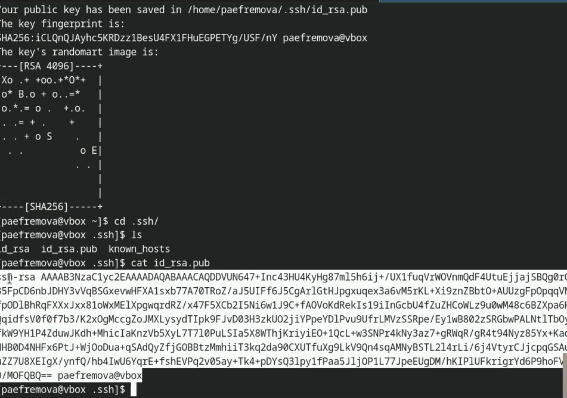

---
## Front matter
title: "Отчет по выполнению лабораторной работы №2"
subtitle: "Дисциплина: Архитектура компьютеров и опрерационные системы"
author: "Ефремова Полина Александровна"

## Generic otions
lang: ru-RU
toc-title: "Содержание"

## Bibliography
bibliography: bib/cite.bib
csl: pandoc/csl/gost-r-7-0-5-2008-numeric.csl

## Pdf output format
toc: true # Table of contents
toc-depth: 2
lof: true # List of figures
lot: true # List of tables
fontsize: 12pt
linestretch: 1.5
papersize: a4
documentclass: scrreprt
## I18n polyglossia
polyglossia-lang:
  name: russian
  options:
	- spelling=modern
	- babelshorthands=true
polyglossia-otherlangs:
  name: english
## I18n babel
babel-lang: russian
babel-otherlangs: english
## Fonts
mainfont: IBM Plex Serif
romanfont: IBM Plex Serif
sansfont: IBM Plex Sans
monofont: IBM Plex Mono
mathfont: STIX Two Math
mainfontoptions: Ligatures=Common,Ligatures=TeX,Scale=0.94
romanfontoptions: Ligatures=Common,Ligatures=TeX,Scale=0.94
sansfontoptions: Ligatures=Common,Ligatures=TeX,Scale=MatchLowercase,Scale=0.94
monofontoptions: Scale=MatchLowercase,Scale=0.94,FakeStretch=0.9
mathfontoptions:
## Biblatex
biblatex: true
biblio-style: "gost-numeric"
biblatexoptions:
  - parentracker=true
  - backend=biber
  - hyperref=auto
  - language=auto
  - autolang=other*
  - citestyle=gost-numeric
## Pandoc-crossref LaTeX customization
figureTitle: "Рис."
tableTitle: "Таблица"
listingTitle: "Листинг"
lofTitle: "Список иллюстраций"
lotTitle: "Список таблиц"
lolTitle: "Листинги"
## Misc options
indent: true
header-includes:
  - \usepackage{indentfirst}
  - \usepackage{float} # keep figures where there are in the text
  - \floatplacement{figure}{H} # keep figures where there are in the text
---

# Цель работы

  Научиться работать с языком разметки Markdown посредством выполнения отчета лабораторной работы №2. 

# Задание

1. Настройка GitHub.
2. Базовая настройка Git.
3. Создание SSH-ключа.
4. Создание рабочего пространства и репозитория курса на основе шаблона.
5. Верификация коммитов с помощью PGP.
6. Настройка каталога курса.

# Теоретическое введение

Система контроля версий ( Version Control System, VCS ) — это инструмент,
используемый
разработчиками
программного
обеспечения
для
управления
изменениями в исходном коде и других файловых ресурсах.
Системы контроля версий разработаны специально для того, чтобы
максимально упростить и упорядочить работу над проектом (вне зависимости от
того, сколько человек в этом участвуют). СКВ дает возможность видеть, кто, когда и
какие изменения вносил; позволяет формировать новые ветви проекта, объединять
уже имеющиеся; настраивать контроль доступа к проекту ; осуществлять откат до
предыдущих версий.
В классических системах контроля версий используется централизованная
модель, предполагающая наличие единого репозитория для хранения файлов.
Выполнение большинства функций по управлению версиями осуществляется
специальным сервером. Участник проекта (пользователь) перед началом работы
посредством определённых команд получает нужную ему версию файлов. После
внесения изменений, пользователь размещает новую версию в хранилище. При этом
предыдущие версии не удаляются из центрального хранилища и к ним можно
вернуться в любой момент. Сервер может сохранять не полную версию изменённых
файлов, а производить так называемую дельта-компрессию — сохранять только
изменения между последовательными версиями, что позволяет уменьшить объём
хранимых данных. Системы контроля версий поддерживают возможность
отслеживания и разрешения конфликтов, которые могут возникнуть при работе
нескольких человек над одним файлом. Можно объединить (слить) изменения,
сделанные разными участниками (автоматически или вручную), вручную выбрать
нужную версию, отменить изменения вовсе или заблокировать файлы для
изменения. В зависимости от настроек блокировка не позволяет другим
пользователям получить рабочую копию или препятствует изменению рабочей
копии файла средствами файловой системы ОС, обеспечивая таким образом,
привилегированный доступ только одному пользователю, работающему с файлом.
Демидова А. В. 14 Архитектура ЭВМ Системы контроля версий также могут
обеспечивать дополнительные, более гибкие функциональные возможности.Например, они могут поддерживать работу с несколькими версиями одного файла,
сохраняя общую историю изменений до точки ветвления версий и собственные
истории изменений каждой ветви. Кроме того, обычно доступна информация о том,
кто из участников, когда и какие изменения вносил. Обычно такого рода информация
хранится в журнале изменений, доступ к которому можно ограничить. В отличие от
классических,
в
распределённых
системах
контроля
версий
центральный
репозиторий не является обязательным. Среди классических VCS наиболее известны
CVS, Subversion, а среди распределённых — Git, Bazaar, Mercurial. Принципы их
работы схожи, отличаются они в основном синтаксисом используемых в работе
команд.
Система контроля версий Git представляет собой набор программ командной
строки. Доступ к ним можно получить из терминала посредством ввода команды git
с различными опциями. Благодаря тому, что Git является распределённой системой
контроля версий, резервную копию локального хранилища можно сделать простым
копированием или архивацией

# Выполнение лабораторной работы

## Установка программного обеспечаения

1. С помощью команд dnf install gh и dnf install git-all устанавливаю необходимое обеспечение (рис. [-@fig:002]).

{#fig:002 width=70%}

## Базовая настройка Git

1. Задаю имя и email владельца репозитория, настраиваю utf-8 в выводе сообщения git, 
задаю имя начальной ветки а также задаю параметры autocrlf и safecrlf (рис. [-@fig:003]).

{#fig:003 width=70%} 

## Создание ключа SSH

1. Создаю ключ по алгоритму 4096 (рис. [-@fig:004]).

{#fig:004 width=70%}

2. Создаю ключ по алгоритму ed25519 (рис. [-@fig:005]).

{#fig:005 width=70%}

3. Добавляю скопированный SSH ключ на GitHub (рис. [-@fig:006]).

{#fig:006 width=70%}

## Создание gpg ключа 

1. Генерирую gpg ключ (рис. [-@fig:007]).

{#fig:007 width=70%}

2. Настраиваю этот gpg ключ указанным способом (рис. [-@fig:008]).

{#fig:008 width=70%}

3. Вывожу список ключей и копирую отпечаток приватного ключа (рис. [-@fig:009]).

{#fig:009 width=70%}

4. Копирую сгенерированный PGP ключ (рис. [-@fig:010]).

{#fig:010 width=70%}

5. Добавляю ключ на Github (рис. [-@fig:011]).

{#fig:011 width=70%}

6. Авторизируюсь, отвечаю на контрольные вопросы (рис. [-@fig:012]).

{#fig:012 width=70%}

7. Ввожу код (рис. [-@fig:013])

{#fig:013 width=70%}

## Создание репозитория курса на основе шаблона 

1. Создаю репозиторий (рис. [-@fig:014]).

{#fig:014 width=70%}

2. Перехожу в него и копирую шаблон (рис. [-@fig:015]).

{#fig:015 width=70%}

3. Перехожу в каталог курса (рис. [-@fig:016]).

{#fig:016 width=70%}

4. Создаю необходимые каталоги (рис. [-@fig:017]).

{#fig:017 width=70%}

5. Отправляю файлы на сервер (рис. [-@fig:018]).

{#fig:018 width=70%}

# Выводы

В заключение хочется отметить, что данная лабораторная работа позволила
мне научиться работать с системой Git. Я практиковала свои навыки в работе с
командной строкой, теперь уже связывая выполнимое с директориями GitHub. 

Кроме этого, я научилась работать с Markdown (вспмонила, опираясь на материалы из прошлого семестра в том числе) 

# Список литературы 

1. [Архитектура ЭВМ](https://esystem.rudn.ru/pluginfile.php/2089082/mod_resource/content/0/Лабораторная%20работа%20№2.%20Система%20контроля%20версий%20Git.pdf)

2. [Ефремова Полина, Лабораторная работа №2, Архитектура компьютеров](https://github.com/Paefremova/study_2024-2025_arh-pc/blob/master/labs/lab02/report/report.md)

3. [Лабораторная 2](https://esystem.rudn.ru/mod/page/view.php?id=1224371)

4. [лабораторная 3](https://esystem.rudn.ru/pluginfile.php/2586858/mod_resource/content/3/003-lab_markdown.pdf)

::: {#refs}
:::
