---
## Front matter
lang: ru-RU
title: Лабораторная работа №4
subtitle: Рабочий процесс git-flow
author:
  - Ефремова Полина Александровна
institute:
  - Российский университет дружбы народов, Москва, Россия
 
date: 06 марта 2025

## i18n babel
babel-lang: russian
babel-otherlangs: english

## Formatting pdf
toc: false
toc-title: Содержание
slide_level: 2
aspectratio: 169
section-titles: true
theme: metropolis
header-includes:
 - \metroset{progressbar=frametitle,sectionpage=progressbar,numbering=fraction}
---

# Информация

## Докладчик

:::::::::::::: {.columns align=center}
::: {.column width="70%"}

  * Ефремова Полина Александровна 
  * студент группы НКАбд-02-24
  * ст.б №1132246726
  * Российский университет дружбы народов
  * polinaefeemova68890@gmail.com
  * <https://github.com/Paefremova/>

:::
::: {.column width="30%"}

:

:::
::::::::::::::

# Вводная часть

## Актуальность

- возможность организовывать рабочее пространство на основе релизов
- улучшение навыков работы с git-flow 

## Объект и предмет исследования 

- git и его продвинутое использование 

## Цели и задачи 
        
- Установка git-flow
- Установка Node.js
- Настройка Node.js
- Общепринятые коммиты
- Практический сценарий использования git
- Создание репозитория git
- Работа с репозиторием git

## Материалы и методы 

- установка, настройка и исследование элементов git 

# Выполнение лабораторной работы 
 
## Установка ПО. Устнановка git-flow, Node.js. Настройка Node.js. Общепринятые коммиты

1. Устанавливаем nodejs и pnpm 

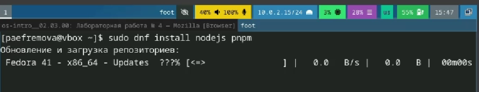{#fig:001 width=60%}

##

2. Устанавливаем  git-glow 

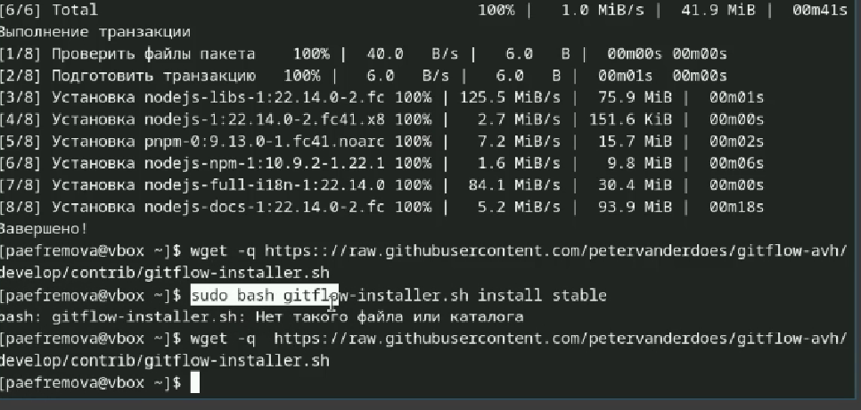{#fig:002 width=70%}

##

3. Для работы с Node.js добавим каталог с исполняемыми файлами, устанавливаемыми yarn, в переменную PATH. 

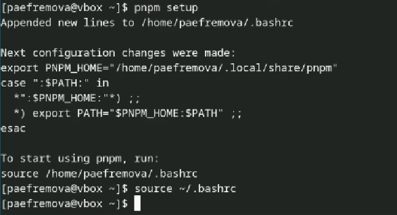{#fig:003 width=70%}

##

4. Настраиваем commitizen, standard-changelog. 

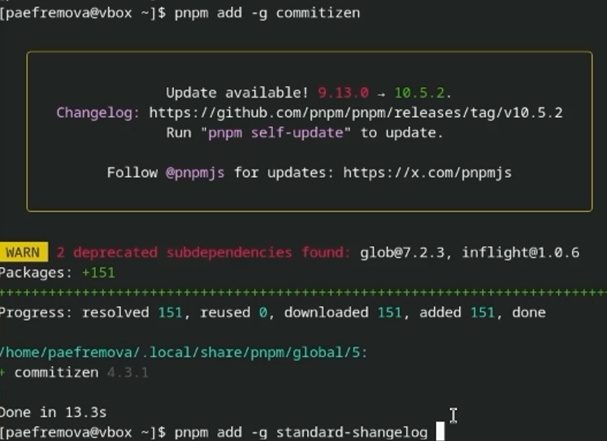{#fig:004 width=70%}

## Практический сценарий использования git.  Создание репозитория. Работа с репозиторием. 

 5. Создаем репозиторий на GitHub. Для примера назовём его git-extended. Делаем первый коммит и выкладываем на github: 

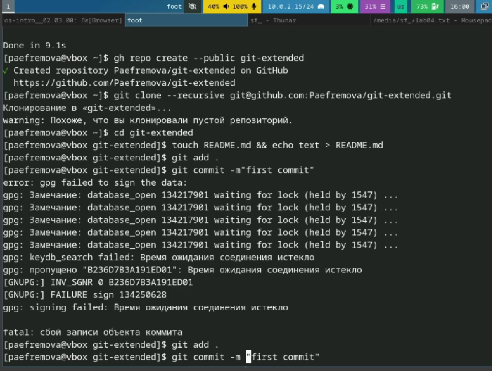{#fig:005 width=70%}

##

6. Конфигурация общепринятых коммитов. Для этого добавим в файл package.json команду для формирования коммитов: 

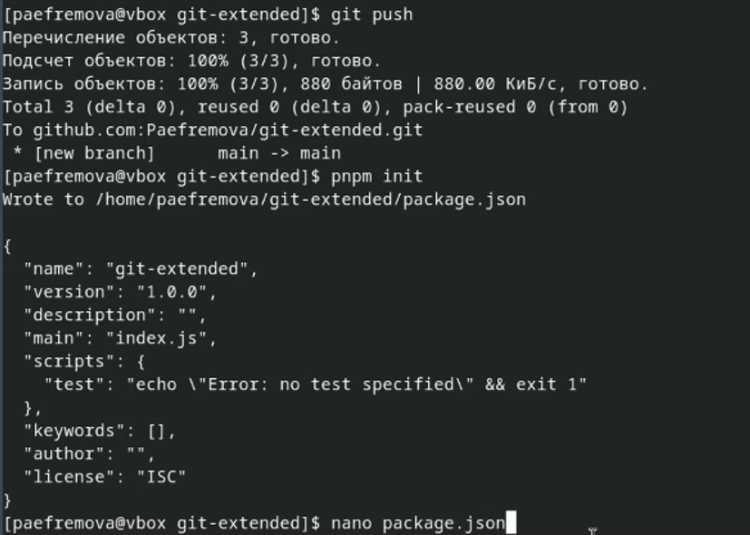{#fig:006 width=70%}

##

7. Добавляем файлы, выполняем коммит, отправляем на Github. 

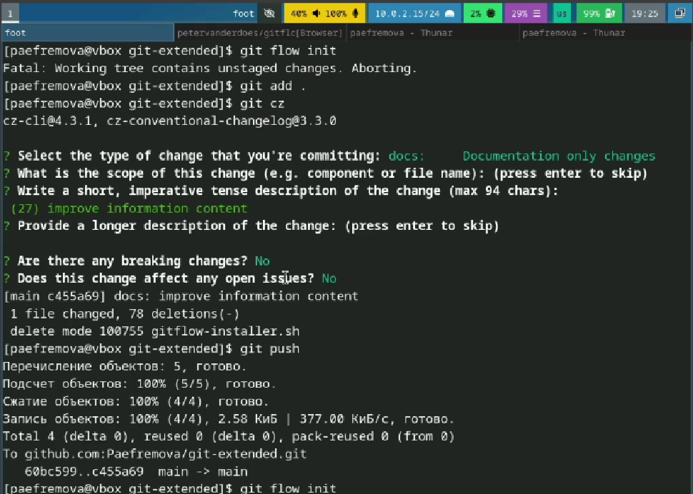{#fig:008 width=70%} 

##

8. Инициализируем git-flow Префикс для ярлыков установим в v. Проверьте, что Вы на ветке develop: Загрузите весь репозиторий в хранилище: Установите внешнюю ветку как вышестоящую для этой ветки:  

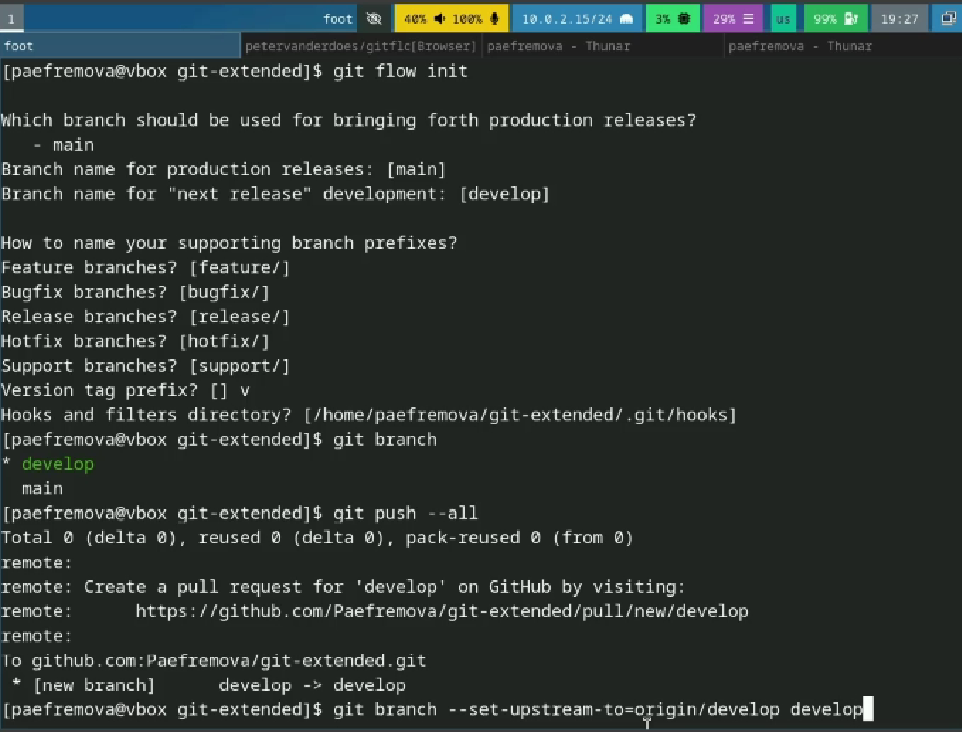{#fig:009 width=70%} 

##

9. Создадим релиз с версией 1.0.0, Создадим журнал изменений Добавим журнал изменений в индекс Зальём релизную ветку в основную ветку  

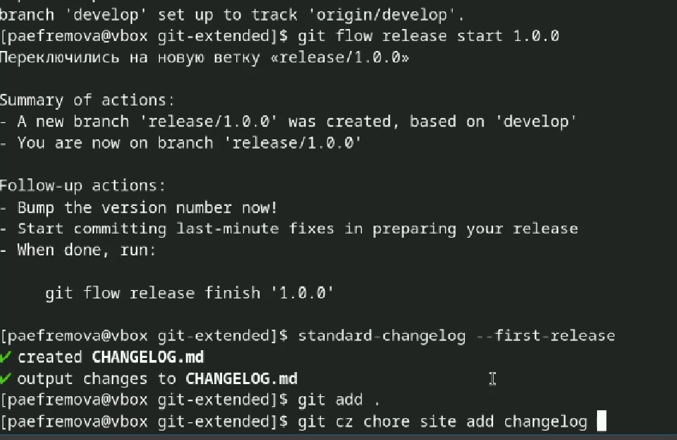{#fig:010 width=70%} 

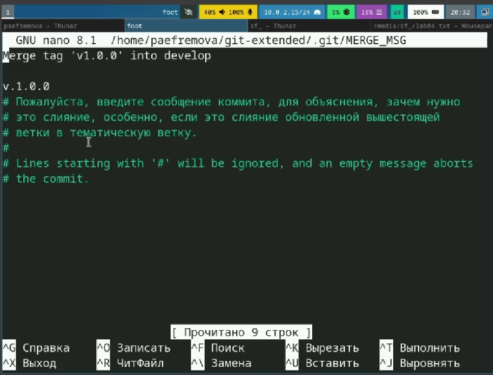{#fig:011 width=70%} 

##

10. Отправим данные на github 

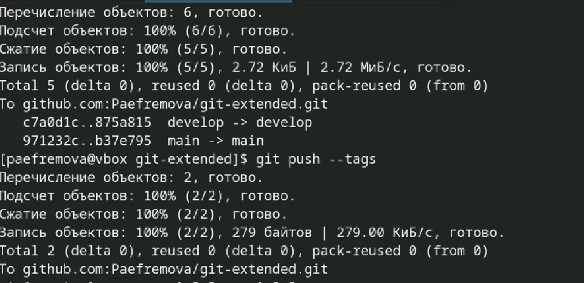{#fig:012 width=70%} 

##

11. Создадим релиз на github, Создадим ветку для новой функциональности. объединить ветку feature_branch c develop. 

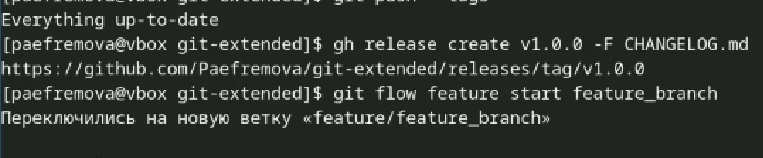{#fig:013 width=70%} 

##

12. Создадим релиз с версией 1.2.3. Обновим номер версии в файле package.json. Установим её в 1.2.3. 

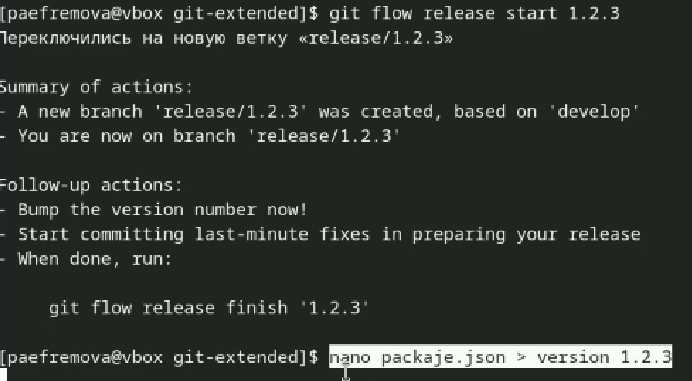{#fig:014 width=70%} 

##

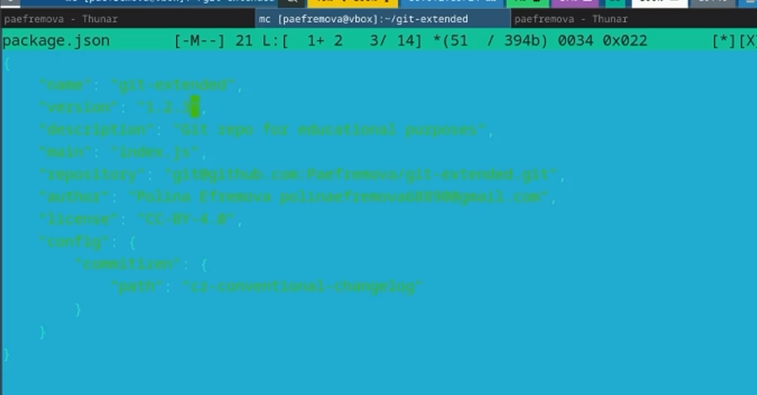{#fig:015 width=70%} 

##

13. Создадим журнал изменений Добавим журнал изменений в индекс, зальем релизную ветку в основную ветку 

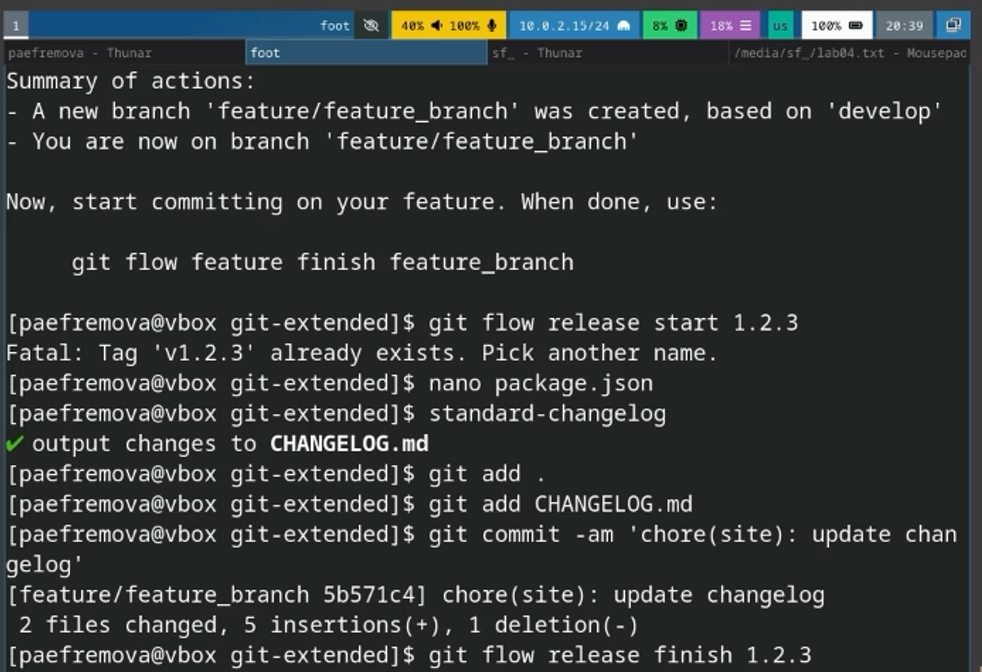{#fig:016 width=70%} 

##

14.Отправим данные на github Создадим релиз на github с комментарием из журнала изменений: 

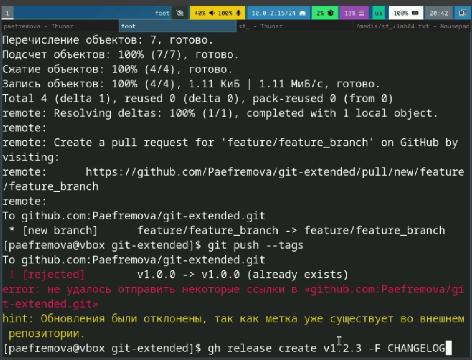{#fig:017 width=70%} 

## Выводы

Мы получили навыки правильной работы с репозиториями git, в особенности с git-flow. Теперь я могу загружать данные через release. 

## Список литературы{.unnumbered}

[Рабочий процесс с Gitflow(электронный ресурс)](https://yamadharma.github.io/ru/post/2021/04/18/gitflow-workflow/)

[Лабораторная №2](https://esystem.rudn.ru/mod/page/view.php?id=1224375)
