---
## Front matter
lang: ru-RU
title: Лабораторная работа №5
subtitle: Менеджер паролей pass
author:
  - Ефремова Полина Александровна
institute:
  - Российский университет дружбы народов, Москва, Россия
 
date: 06 марта 2025

## i18n babel
babel-lang: russian
babel-otherlangs: english

## Formatting pdf
toc: false
toc-title: Содержание
slide_level: 2
aspectratio: 169
section-titles: true
theme: metropolis
header-includes:
 - \metroset{progressbar=frametitle,sectionpage=progressbar,numbering=fraction}
---

# Информация

## Докладчик

:::::::::::::: {.columns align=center}
::: {.column width="70%"}

  * Ефремова Полина Александровна 
  * студент группы НКАбд-02-24
  * ст.б №1132246726
  * Российский университет дружбы народов
  * polinaefeemova68890@gmail.com
  * <https://github.com/Paefremova/>

:::
::: {.column width="30%"}

:

:::
::::::::::::::

# Вводная часть

## Актуальность

- Данные хранятся в файловой системе в виде каталогов и файлов.
- Файлы шифруются с помощью GPG-ключа.

## Объект и предмет исследования

Менеджер паролей pass

## Цели и задачи

Научиться работать с менеджером паролей pass 

## Материалы и методы

-Установка
-Настройка
-Настройка интерфейса с броузером
-Сохранение пароля
-Управление файлами конфигурации

## Теоретическое введение

Менеджер паролей pass — программа, сделанная в рамках идеологии Unix.
Также носит название стандартного менеджера паролей для Unix (The standard Unix password manager).

Основные свойства

Данные хранятся в файловой системе в виде каталогов и файлов.
Файлы шифруются с помощью GPG-ключа.

Структура базы паролей

Структура базы может быть произвольной, если Вы собираетесь использовать её напрямую, без промежуточного программного обеспечения. Тогда семантику структуры базы данных Вы держите в своей голове.
Если же необходимо использовать дополнительное программное обеспечение, необходимо семантику заложить в структуру базы паролей.

# Выполнение лабораторной работы

## Установка pass и gopass 

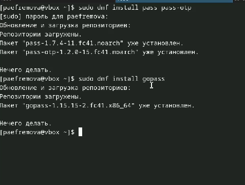{#fig:001 width=70%}

## Инициализация хранилища, + ключ gpg  

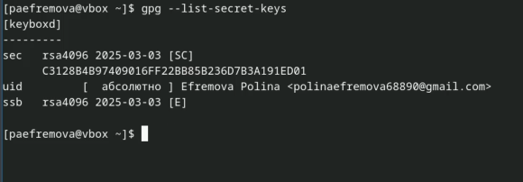{#fig:002 width=70%}

## Синхронизация с git

Создадим структуру git:
Также можно задать адрес репозитория на хостинге (репозиторий необходимо предварительно создать) 

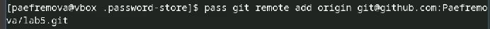{#fig:003 width=70%}

##

Ну и провожу саму синхронизацию 

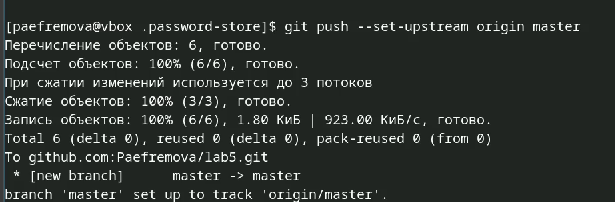{#fig:004 width=50%} 

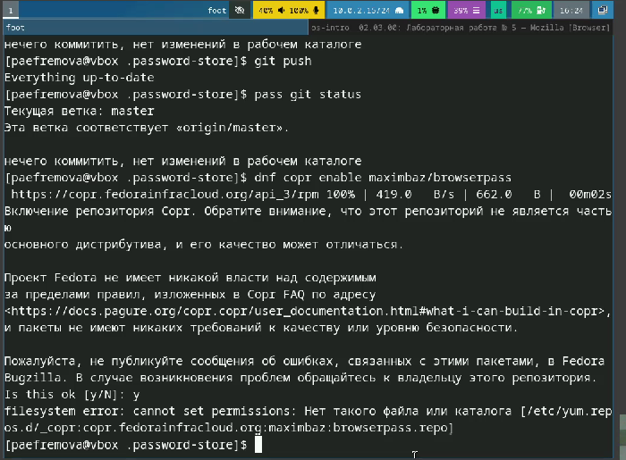{#fig:005 width=50%} 

##

Настройка интерфейса с броузером 

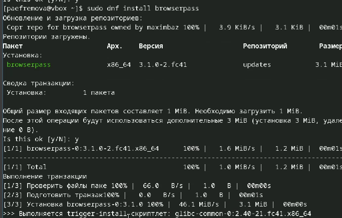{#fig:006 width=70%}

## Сохранение пароля 
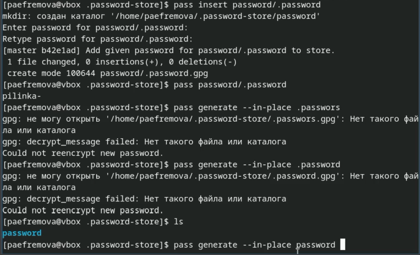{#fig:007 width=70%}

## Установка дополнительного ПО 

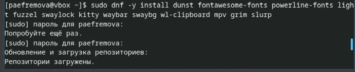{#fig:008 width=70%}

## Устанавливаю шрифты 

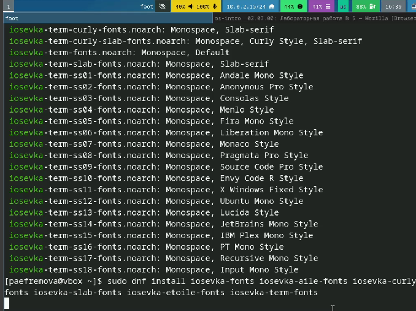{#fig:009 width=70%}

## Установка бинарного файла. Скрипт определяет архитектуру процессора и операционную систему и скачивает необходимый файл, Создание своего репозитория для конфигурационных файлов на основе шаблона, Инициализация chezmoi с моим репозиторием dotfiles, вижу какие изменения внесёт chezmoi в домашний каталог, запустив команду 

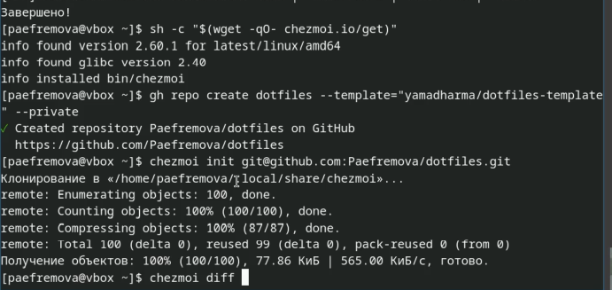{#fig:010 width=70%}

## Изменения устраивают, поэтому подтверждаю их 

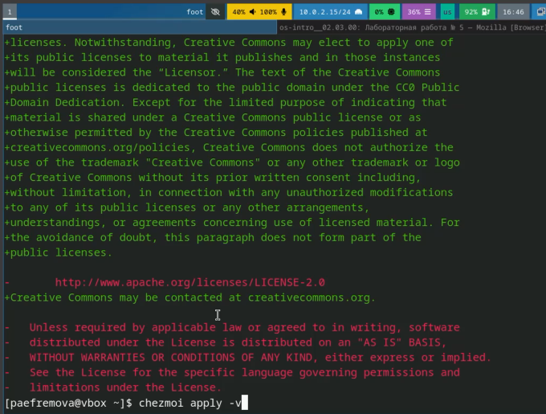{#fig:011 width=70%}

## провожу Ежедневные операции c chezmoi 

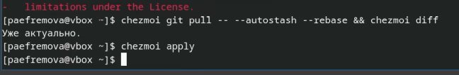{#fig:012 width=70%}

## Автоматически фиксирую и отправляю изменения в репозиторий 

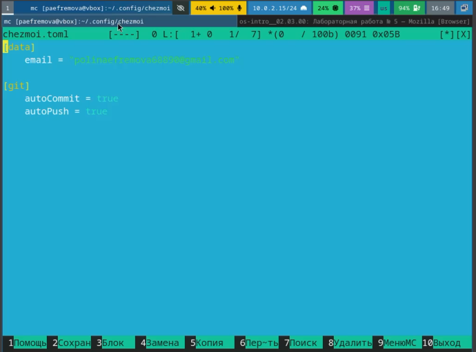{#fig:013 width=70%}

## Выводы

Менеджер паролей pass важен для работы с git. Работа с ним не такая сложная, поэтому данная работа была выполнена достаточно быстро! 
Ошибки возникли лишь при создании репозитория, в остальном мне было интересно. 

## Список литературы{.unnumbered}

[Лабораторная №5](https://esystem.rudn.ru/mod/page/view.php?id=1224377#orgb06553f)

::: {#refs}
:::
