---
## Front matter
title: "Отчет по выполнению лабораторной работы №5"
subtitle: "Архитектура компьютера и операционные системы"
author: "Ефремова Полина Александровна"

## Generic otions
lang: ru-RU
toc-title: "Содержание"

## Bibliography
bibliography: bib/cite.bib
csl: pandoc/csl/gost-r-7-0-5-2008-numeric.csl

## Pdf output format
toc: true # Table of contents
toc-depth: 2
lof: true # List of figures
lot: true # List of tables
fontsize: 12pt
linestretch: 1.5
papersize: a4
documentclass: scrreprt
## I18n polyglossia
polyglossia-lang:
  name: russian
  options:
	- spelling=modern
	- babelshorthands=true
polyglossia-otherlangs:
  name: english
## I18n babel
babel-lang: russian
babel-otherlangs: english
## Fonts
mainfont: IBM Plex Serif
romanfont: IBM Plex Serif
sansfont: IBM Plex Sans
monofont: IBM Plex Mono
mathfont: STIX Two Math
mainfontoptions: Ligatures=Common,Ligatures=TeX,Scale=0.94
romanfontoptions: Ligatures=Common,Ligatures=TeX,Scale=0.94
sansfontoptions: Ligatures=Common,Ligatures=TeX,Scale=MatchLowercase,Scale=0.94
monofontoptions: Scale=MatchLowercase,Scale=0.94,FakeStretch=0.9
mathfontoptions:
## Biblatex
biblatex: true
biblio-style: "gost-numeric"
biblatexoptions:
  - parentracker=true
  - backend=biber
  - hyperref=auto
  - language=auto
  - autolang=other*
  - citestyle=gost-numeric
## Pandoc-crossref LaTeX customization
figureTitle: "Рис."
tableTitle: "Таблица"
listingTitle: "Листинг"
lofTitle: "Список иллюстраций"
lotTitle: "Список таблиц"
lolTitle: "Листинги"
## Misc options
indent: true
header-includes:
  - \usepackage{indentfirst}
  - \usepackage{float} # keep figures where there are in the text
  - \floatplacement{figure}{H} # keep figures where there are in the text
---

# Цель работы

Научиться работать с менеджером паролей pass 

# Задание

Менеджер паролей pass
-Установка
-Настройка
-Настройка интерфейса с броузером
-Сохранение пароля
-Управление файлами конфигурации
Дополнительное программное обеспечение
-Установка
-Создание собственного репозитория с помощью утилит
-Подключение репозитория к своей системе
-Использование chezmoi на нескольких машинах
-Настройка новой машины с помощью одной команды
-Ежедневные операции c chezmoi

# Теоретическое введение

Менеджер паролей pass — программа, сделанная в рамках идеологии Unix.
Также носит название стандартного менеджера паролей для Unix (The standard Unix password manager).

Основные свойства

Данные хранятся в файловой системе в виде каталогов и файлов.
Файлы шифруются с помощью GPG-ключа.

Структура базы паролей

Структура базы может быть произвольной, если Вы собираетесь использовать её напрямую, без промежуточного программного обеспечения. Тогда семантику структуры базы данных Вы держите в своей голове.
Если же необходимо использовать дополнительное программное обеспечение, необходимо семантику заложить в структуру базы паролей.

# Выполнение лабораторной работы

1. Установка pass и gopass (рис. [-@fig:001]).

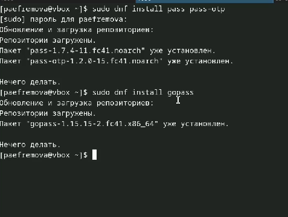{#fig:001 width=70%}

2. Инициализация хранилища, + ключ gpg  (рис. [-@fig:002]).

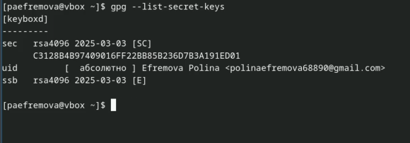{#fig:002 width=70%}

3. Синхронизация с git

Создадим структуру git:
Также можно задать адрес репозитория на хостинге (репозиторий необходимо предварительно создать) (рис. [-@fig:003]).

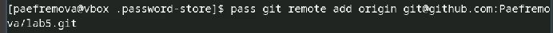{#fig:003 width=70%}

Ну и провожу саму синхронизацию (рис. [-@fig:004]). (рис. [-@fig:005]).

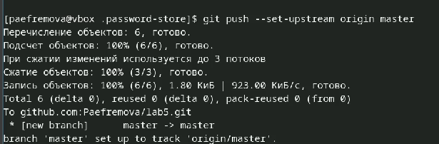{#fig:004 width=70%} 

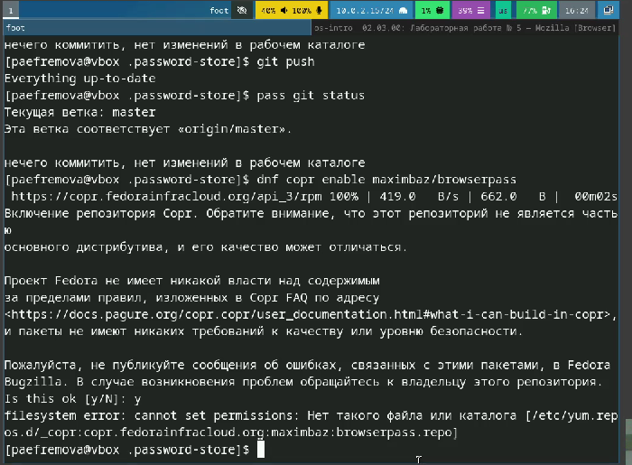{#fig:005 width=70%} 

4. Настройка интерфейса с броузером (рис. [-@fig:006]).

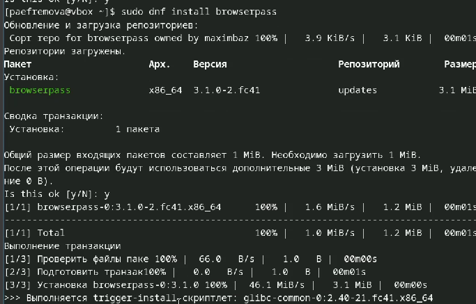{#fig:006 width=70%}

5. Сохранение пароля (рис. [-@fig:007]).

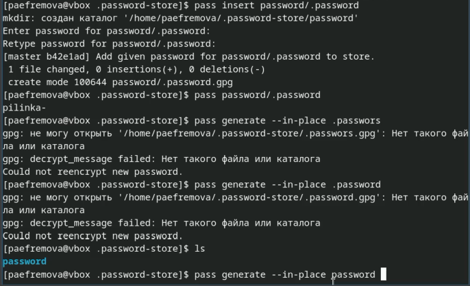{#fig:007 width=70%}

6. Установка дополнительного ПО (рис. [-@fig:008]).

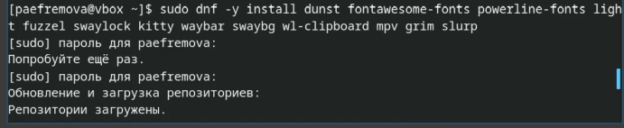{#fig:008 width=70%}

7. Устанавливаю шрифты (рис. [-@fig:009]).

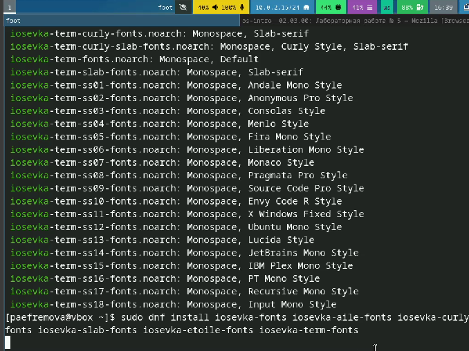{#fig:009 width=70%}

8. Установка бинарного файла. Скрипт определяет архитектуру процессора и операционную систему и скачивает необходимый файл, Создание своего репозитория для конфигурационных файлов на основе шаблона, Инициализация chezmoi с моим репозиторием dotfiles, вижу какие изменения внесёт chezmoi в домашний каталог, запустив команду (рис. [-@fig:010]).

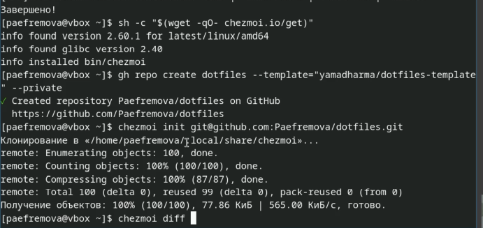{#fig:010 width=70%}

9. Изменения устраивают, поэтому подтверждаю их (рис. [-@fig:011]).

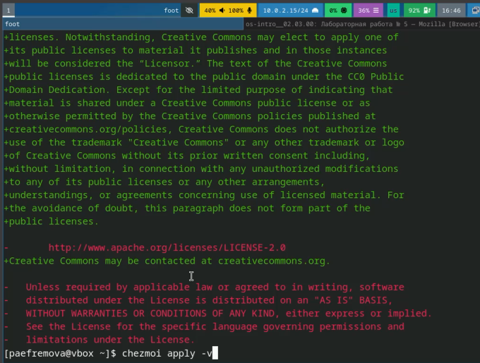{#fig:011 width=70%}

10. провожу Ежедневные операции c chezmoi (рис. [-@fig:012]).

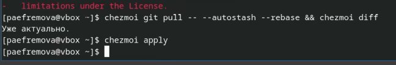{#fig:012 width=70%}

11. Автоматически фиксирую и отправляю изменения в репозиторий (рис. [-@fig:013]).

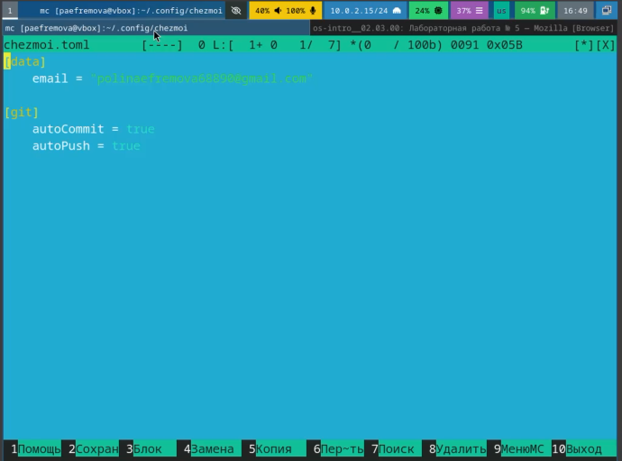{#fig:013 width=70%}

# Выводы

Менеджер паролей pass важен для работы с git. Работа с ним не такая сложная, поэтому данная работа была выполнена достаточно быстро! 
Ошибки возникли лишь при создании репозитория, в остальном мне было интересно. 

# Список литературы{.unnumbered}

[Лабораторная №5](https://esystem.rudn.ru/mod/page/view.php?id=1224377#orgb06553f)

::: {#refs}
:::
