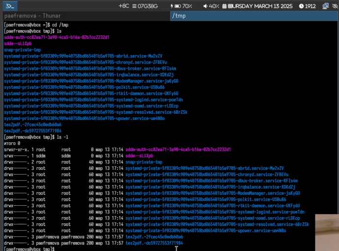
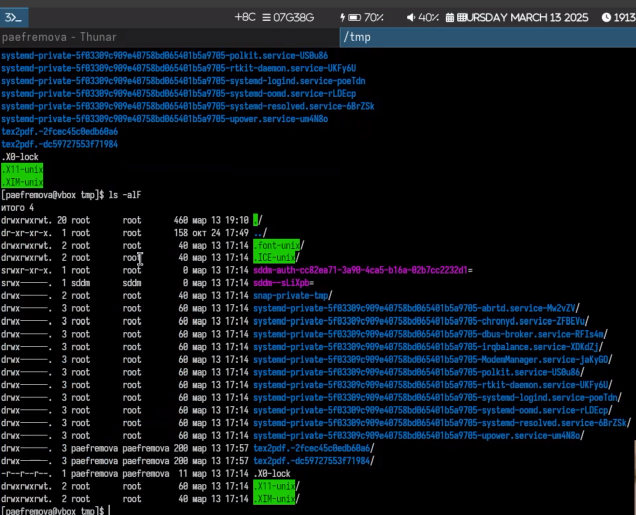
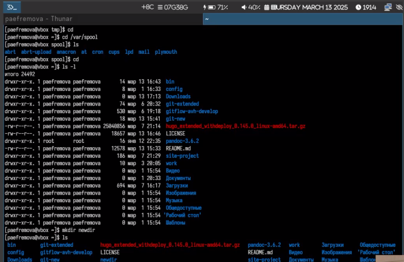
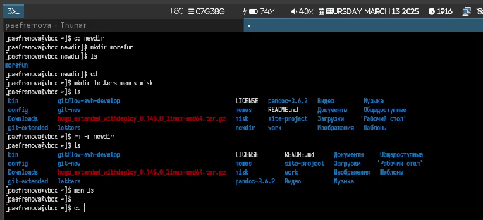
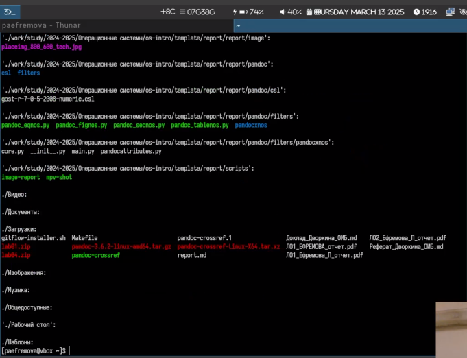
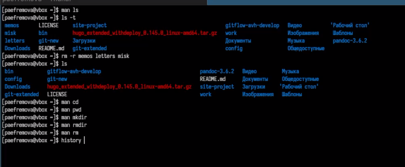
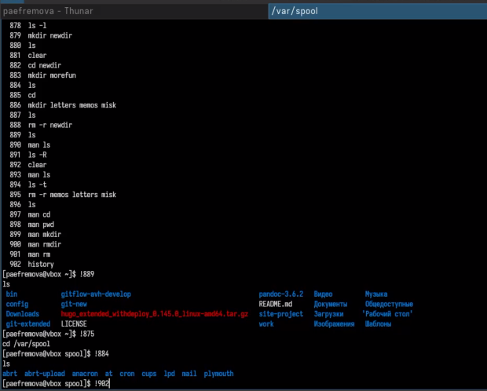

---
## Front matter
lang: ru-RU
title: Лабораторная работа №6
subtitle: Настройка рабочей среды
author:
  - Ефремова Полина Александровна
institute:
  - Российский университет дружбы народов, Москва, Россия
 
date: 18 марта 2025

## i18n babel
babel-lang: russian
babel-otherlangs: english

## Formatting pdf
toc: false
toc-title: Содержание
slide_level: 2
aspectratio: 169
section-titles: true
theme: metropolis
header-includes:
 - \metroset{progressbar=frametitle,sectionpage=progressbar,numbering=fraction}
---

# Информация

## Докладчик

:::::::::::::: {.columns align=center}
::: {.column width="70%"}

  * Ефремова Полина Александровна 
  * студент группы НКАбд-02-24
  * ст.б №1132246726
  * Российский университет дружбы народов
  * polinaefeemova68890@gmail.com
  * <https://github.com/Paefremova/>

:::
::: {.column width="30%"}

:

:::
::::::::::::::

# Вводная часть

## Актуальность

- упрощение работы с комндной строкой 

## Объект и предмет исследования

- командная строка

## Цели и задачи

1. Работа через консоль с каталогами, переход в них, просмотр содержимого

2. Поиск информации о командах

3. Создание папок, файлов и их удаление

## Теоретическое введение

В операционной системе типа Linux взаимодействие пользователя с системой обычно
осуществляется с помощью командной строки посредством построчного ввода ко-
манд. При этом обычно используется командные интерпретаторы языка shell: /bin/sh;
/bin/csh; /bin/ksh.

**Формат команды.** Командой в операционной системе называется записанный по
специальным правилам текст (возможно с аргументами), представляющий собой ука-
зание на выполнение какой-либо функций (или действий) в операционной системе.
Обычно первым словом идёт имя команды, остальной текст — аргументы или опции,
конкретизирующие действие.
Общий формат команд можно представить следующим образом:
<имя_команды><разделитель><аргументы>

## Выполнение лабораторной работы

1. Определяю полное имя  домашнего каталога. Далее относительно этого ката-
лога будут выполняться последующие упражнения.

2. Перехожу в каталог /tmp и вывожу на экран содержимое каталога /tmp. Для этого использую команду ls
с различными опциями. 

{#fig:001 width=70%}

{#fig:002 width=70%}

##

3. Определяю что в каталоге /var/spool есть подкаталог с именем cron, перехожу в свой домашний каталог и вывожу на экран его содержимое. Я - владелец.
В домашнем каталоге создаю новый каталог с именем newdir.

{#fig:003 width=70%}

##

4. В каталоге ~/newdir создаю новый каталог с именем morefun. В домашнем каталоге создаю одной командой три новых каталога с именами
letters, memos, misk. Затем удаляю эти каталоги одной командой и также удаляю mkdir 

{#fig:004 width=70%}

##

5. С помощью команды man определяю, какую опцию команды ls нужно использо-
вать для просмотра содержимое не только указанного каталога, но и подкаталогов,
входящих в него. Это ls -r 

{#fig:005 width=70%}

##

6. С помощью команды man определяю набор опций команды ls, позволяющий отсорти-
ровать по времени последнего изменения выводимый список содержимого каталога
с развёрнутым описанием файлов. Это ls -t. А также использую команду man для просмотра описания следующих команд: cd, pwd, mkdir,
rmdir, rm. 

{#fig:006 width=70%}

##

7. Используя информацию, полученную при помощи команды history, выполняю мо-
дификацию и исполнение нескольких команд из буфера команд. 

{#fig:007 width=70%}

## Выводы

Данная работа не вызвала затруднений, так как практически идентична работе с прошлого семестра! Выполнить ее было достаточно просто. 

## Список литературы{.unnumbered}

[Лабораторная 6](https://esystem.rudn.ru/mod/page/view.php?id=1224377)

::: {#refs}
:::
