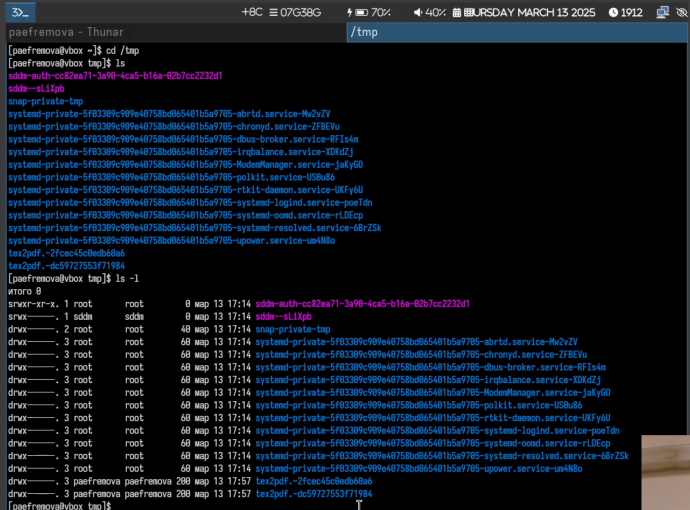
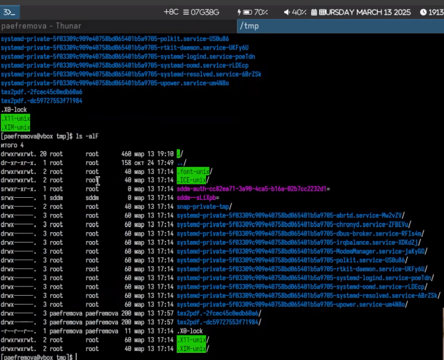
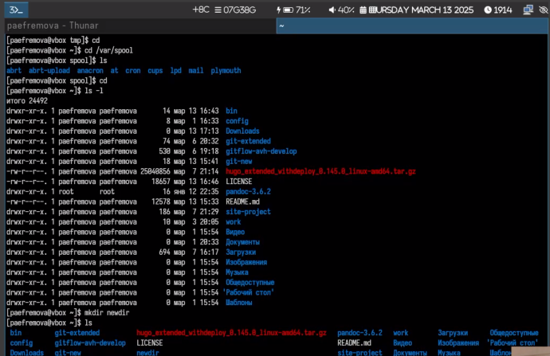
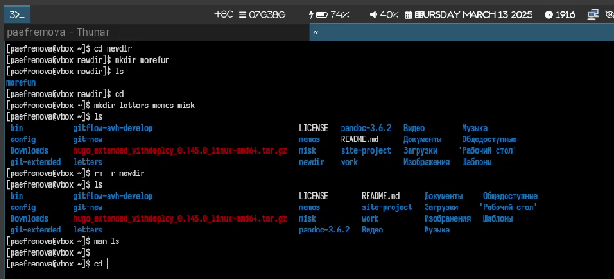
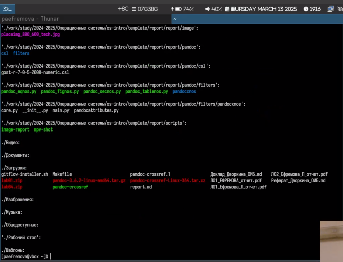
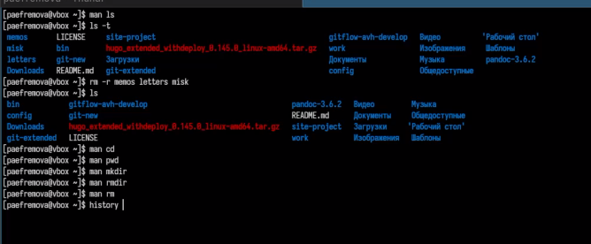
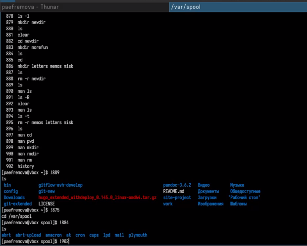

---
## Front matter
title: "Отчет по выполнению лабораторной работы №6"
subtitle: "Архитектура компьютеров и операционные системы"
author: "Ефремова Полина Александровнав"

## Generic otions
lang: ru-RU
toc-title: "Содержание"

## Bibliography
bibliography: bib/cite.bib
csl: pandoc/csl/gost-r-7-0-5-2008-numeric.csl

## Pdf output format
toc: true # Table of contents
toc-depth: 2
lof: true # List of figures
lot: true # List of tables
fontsize: 12pt
linestretch: 1.5
papersize: a4
documentclass: scrreprt
## I18n polyglossia
polyglossia-lang:
  name: russian
  options:
	- spelling=modern
	- babelshorthands=true
polyglossia-otherlangs:
  name: english
## I18n babel
babel-lang: russian
babel-otherlangs: english
## Fonts
mainfont: IBM Plex Serif
romanfont: IBM Plex Serif
sansfont: IBM Plex Sans
monofont: IBM Plex Mono
mathfont: STIX Two Math
mainfontoptions: Ligatures=Common,Ligatures=TeX,Scale=0.94
romanfontoptions: Ligatures=Common,Ligatures=TeX,Scale=0.94
sansfontoptions: Ligatures=Common,Ligatures=TeX,Scale=MatchLowercase,Scale=0.94
monofontoptions: Scale=MatchLowercase,Scale=0.94,FakeStretch=0.9
mathfontoptions:
## Biblatex
biblatex: true
biblio-style: "gost-numeric"
biblatexoptions:
  - parentracker=true
  - backend=biber
  - hyperref=auto
  - language=auto
  - autolang=other*
  - citestyle=gost-numeric
## Pandoc-crossref LaTeX customization
figureTitle: "Рис."
tableTitle: "Таблица"
listingTitle: "Листинг"
lofTitle: "Список иллюстраций"
lotTitle: "Список таблиц"
lolTitle: "Листинги"
## Misc options
indent: true
header-includes:
  - \usepackage{indentfirst}
  - \usepackage{float} # keep figures where there are in the text
  - \floatplacement{figure}{H} # keep figures where there are in the text
---

# Цель работы

Приобретение практических навыков взаимодействия пользователя с системой по-
средством командной строки.

# Задание

1. Работа через консоль с каталогами, переход в них, просмотр содержимого

2. Поиск информации о командах

3. Создание папок, файлов и их удаление

# Теоретическое введение

В операционной системе типа Linux взаимодействие пользователя с системой обычно
осуществляется с помощью командной строки посредством построчного ввода ко-
манд. При этом обычно используется командные интерпретаторы языка shell: /bin/sh;
/bin/csh; /bin/ksh.

**Формат команды.** Командой в операционной системе называется записанный по
специальным правилам текст (возможно с аргументами), представляющий собой ука-
зание на выполнение какой-либо функций (или действий) в операционной системе.
Обычно первым словом идёт имя команды, остальной текст — аргументы или опции,
конкретизирующие действие.
Общий формат команд можно представить следующим образом:
<имя_команды><разделитель><аргументы>

# Выполнение лабораторной работы

1. Определяю полное имя  домашнего каталога. Далее относительно этого ката-
лога будут выполняться последующие упражнения.

2. Перехожу в каталог /tmp и вывожу на экран содержимое каталога /tmp. Для этого использую команду ls
с различными опциями. (рис. [-@fig:001]). (рис. [-@fig:002]).

{#fig:001 width=70%}

{#fig:002 width=70%}

3. Определяю что в каталоге /var/spool есть подкаталог с именем cron, перехожу в свой домашний каталог и вывожу на экран его содержимое. Я - владелец.
В домашнем каталоге создаю новый каталог с именем newdir.(рис. [-@fig:003]).

{#fig:003 width=70%}

4. В каталоге ~/newdir создаю новый каталог с именем morefun. В домашнем каталоге создаю одной командой три новых каталога с именами
letters, memos, misk. Затем удаляю эти каталоги одной командой и также удаляю mkdir (рис. [-@fig:004]).

{#fig:004 width=70%}

5. С помощью команды man определяю, какую опцию команды ls нужно использо-
вать для просмотра содержимое не только указанного каталога, но и подкаталогов,
входящих в него. Это ls -r (рис. [-@fig:005]).

{#fig:005 width=70%}

6. С помощью команды man определяю набор опций команды ls, позволяющий отсорти-
ровать по времени последнего изменения выводимый список содержимого каталога
с развёрнутым описанием файлов. Это ls -t. А также использую команду man для просмотра описания следующих команд: cd, pwd, mkdir,
rmdir, rm. (рис. [-@fig:006]).

{#fig:006 width=70%}

7. Используя информацию, полученную при помощи команды history, выполняю мо-
дификацию и исполнение нескольких команд из буфера команд. (рис. [-@fig:007]).

{#fig:007 width=70%}

# Выводы

Данная работа не вызвала затруднений, так как практически идентична работе с прошлого семестра! Выполнить ее было достаточно просто. 

# Список литературы{.unnumbered}

[Лабораторная 6](https://esystem.rudn.ru/mod/page/view.php?id=1224377)

::: {#refs}
:::
