---
## Front matter
title: "Отчет по выполнению лабораторной работы №7"
subtitle: "Архитектура компьютеров и Операционные системы"
author: "Ефремова Полина Александровна"

## Generic otions
lang: ru-RU
toc-title: "Содержание"

## Bibliography
bibliography: bib/cite.bib
csl: pandoc/csl/gost-r-7-0-5-2008-numeric.csl

## Pdf output format
toc: true # Table of contents
toc-depth: 2
lof: true # List of figures
lot: true # List of tables
fontsize: 12pt
linestretch: 1.5
papersize: a4
documentclass: scrreprt
## I18n polyglossia
polyglossia-lang:
  name: russian
  options:
	- spelling=modern
	- babelshorthands=true
polyglossia-otherlangs:
  name: english
## I18n babel
babel-lang: russian
babel-otherlangs: english
## Fonts
mainfont: IBM Plex Serif
romanfont: IBM Plex Serif
sansfont: IBM Plex Sans
monofont: IBM Plex Mono
mathfont: STIX Two Math
mainfontoptions: Ligatures=Common,Ligatures=TeX,Scale=0.94
romanfontoptions: Ligatures=Common,Ligatures=TeX,Scale=0.94
sansfontoptions: Ligatures=Common,Ligatures=TeX,Scale=MatchLowercase,Scale=0.94
monofontoptions: Scale=MatchLowercase,Scale=0.94,FakeStretch=0.9
mathfontoptions:
## Biblatex
biblatex: true
biblio-style: "gost-numeric"
biblatexoptions:
  - parentracker=true
  - backend=biber
  - hyperref=auto
  - language=auto
  - autolang=other*
  - citestyle=gost-numeric
## Pandoc-crossref LaTeX customization
figureTitle: "Рис."
tableTitle: "Таблица"
listingTitle: "Листинг"
lofTitle: "Список иллюстраций"
lotTitle: "Список таблиц"
lolTitle: "Листинги"
## Misc options
indent: true
header-includes:
  - \usepackage{indentfirst}
  - \usepackage{float} # keep figures where there are in the text
  - \floatplacement{figure}{H} # keep figures where there are in the text
---

# Цель работы

Ознакомление с файловой системой Linux, её структурой, именами и содержанием
каталогов. Приобретение практических навыков по применению команд для работы
с файлами и каталогами, по управлению процессами (и работами), по проверке исполь-
зования диска и обслуживанию файловой системы

# Задание

1. Анализ файловой системы Linux.
2. Выполнение команд для работы с файлами и каталогами

# Теоретическое введение

Для создания текстового файла можно использовать команду touch.

Для просмотра файлов постранично удобнее использовать команду less.

Для просмотра файлов небольшого размера можно использовать команду cat.

Команда cp используется для копирования файлов и каталогов.

Команды mv и mvdir предназначены для перемещения и переименования файлов
и каталогов.

Каждый файл или каталог имеет права доступа

В сведениях о файле или каталоге указываются:

– тип файла (символ (-) обозначает файл, а символ (d) — каталог);

– права для владельца файла (r — разрешено чтение, w — разрешена запись, x — разре-
шено выполнение, - — право доступа отсутствует);

– права для членов группы (r — разрешено чтение, w — разрешена запись, x — разрешено
выполнение, - — право доступа отсутствует);

– права для всех остальных (r — разрешено чтение, w — разрешена запись, x — разрешено
выполнение, - — право доступа отсутствует).

Права доступа к файлу или каталогу можно изменить, воспользовавшись командой
chmod. Сделать это может владелец файла (или каталога) или пользователь с правами
администратора.

Файловая система в Linux состоит из фалов и каталогов. Каждому физическому носи-
телю соответствует своя файловая система.
Существует несколько типов файловых систем. Перечислим наиболее часто встречаю-
щиеся типы:
– ext2fs (second extended filesystem);
– ext2fs (third extended file system);
– ext4 (fourth extended file system);
– ReiserFS;
– xfs;
– fat (file allocation table);
– ntfs (new technology file system)

# Выполнение лабораторной работы

1. Выполняю все примеры, которые были представлены в лабораторной работе (рис. [-@fig:001]). (рис. [-@fig:002]). (рис. [-@fig:003]). (рис. [-@fig:004]). (рис. [-@fig:005]).

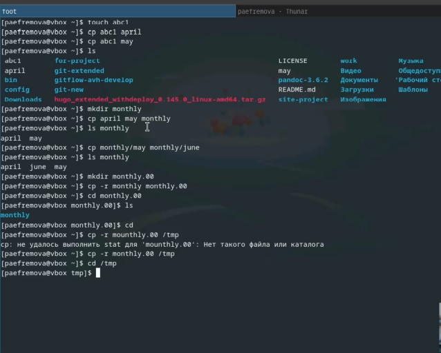{#fig:001 width=70%}

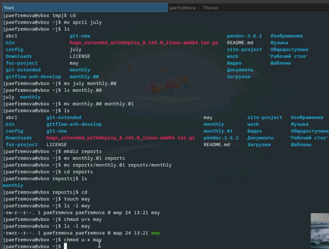{#fig:002 width=70%}

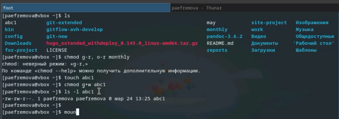{#fig:003 width=70%}

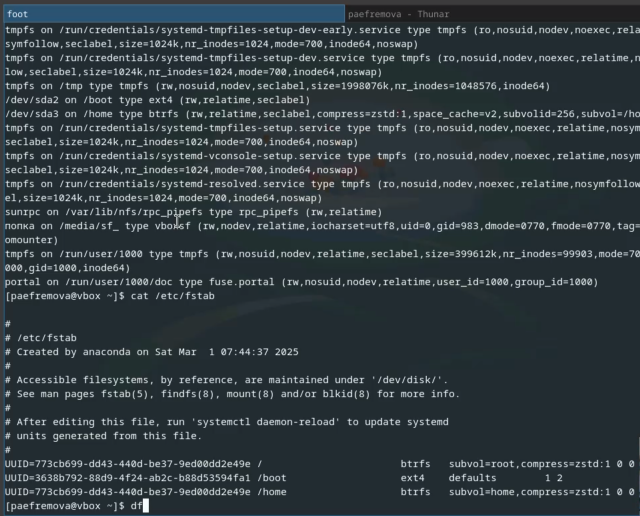{#fig:004 width=70%}

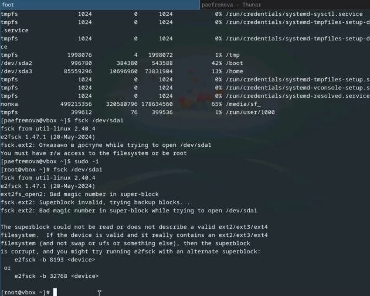{#fig:005 width=70%}

2. Скопирую файл /usr/include/sys/io.h в домашний каталог и назовите его
equipment.  В домашнем каталоге создаю директорию ~/ski.plases. Перемещаю файл equipment в каталог ~/ski.plases. Переименую файл ~/ski.plases/equipment в ~/ski.plases/equiplist.
Создаю в домашнем каталоге файл abc1 и скопирую его в каталог ~/ski.plases, назовите его equiplist2 Создаю каталог с именем equipment в каталоге ~/ski.plases.(рис. [-@fig:006]).

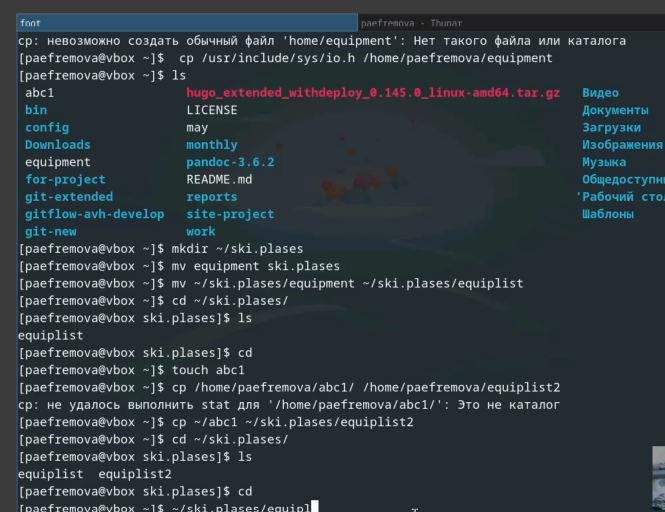{#fig:006 width=70%}

3. Перемещаю файлы ~/ski.plases/equiplist и equiplist2 в каталог ~/ski.plases/equipment. Создаю и перемещаю каталог ~/newdir в каталог ~/ski.plases и назову его plans. (рис. [-@fig:007]).

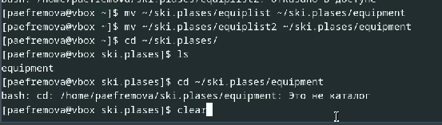{#fig:007 width=70%}

4. Определяю опции команды chmod, необходимые для того, чтобы присвоить перечис-
ленным ниже файлам выделенные права доступа, считая, что в начале таких прав
нет (рис. [-@fig:008]).(рис. [-@fig:009]).

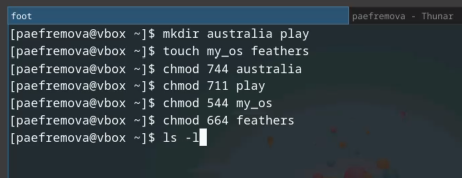{#fig:008 width=70%}

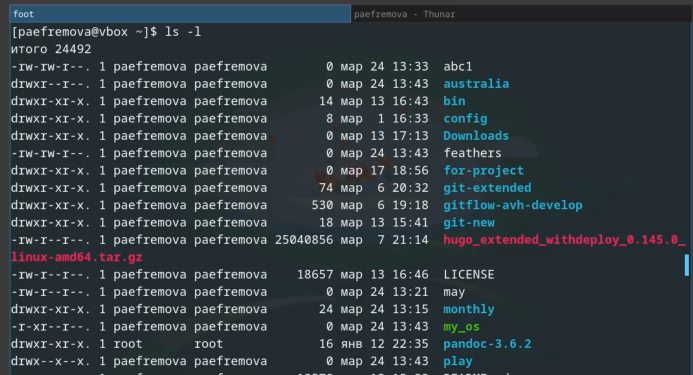{#fig:009 width=70%}

5. Просмотрю содержимое файла /etc/password. (рис. [-@fig:010]).

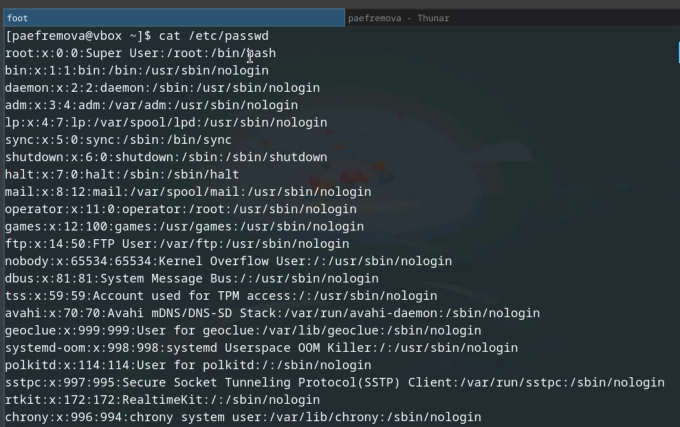{#fig:010 width=70%}

6.Копирую файл ~/feathers в файл ~/file.old. Переместите файл ~/file.old в каталог ~/play. Скопируйте каталог ~/play в каталог ~/fun. Переместите каталог ~/fun в каталог ~/play и назовите его games. Лишите владельца файла ~/feathers права на чтение.
если вы попытаться просмотреть файл ~/feathers командой cat, то отказ в доступе
если попытаюсь скопировать файл ~/feathers, то тоже отказ в доступе Даю владельцу файла ~/feathers право на чтение. 
Лишаю владельца каталога ~/play права на выполнение, перейдя в каталог ~/play. вижу, что отказано в доступе(
Поэтому даю владельцу данного каталога права на выполнение (рис. [-@fig:011]).

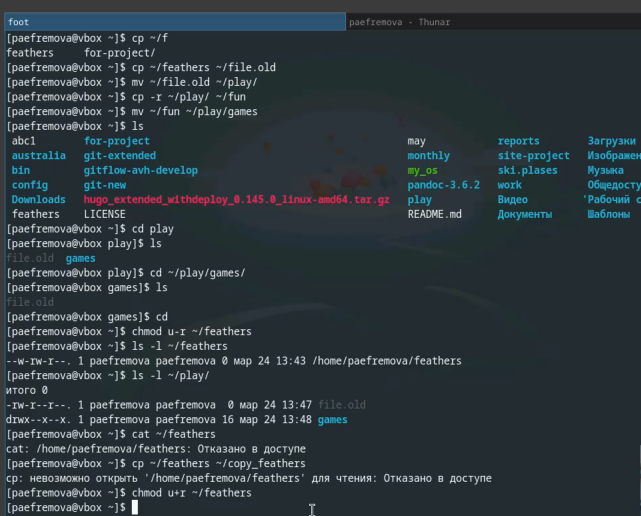{#fig:011 width=70%}

7. Команда mount и что она значит. (рис. [-@fig:012]).

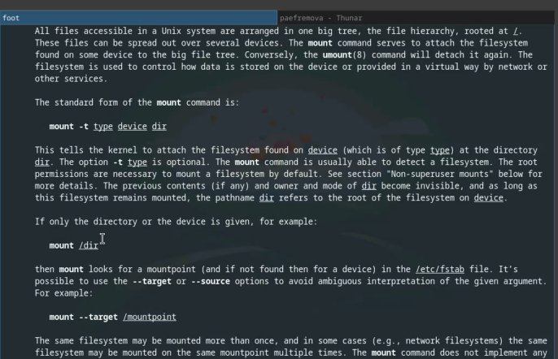{#fig:012 width=70%}

8. А также команды mkfs, fsck и kill (рис. [-@fig:013]). (рис. [-@fig:014]). (рис. [-@fig:015]).

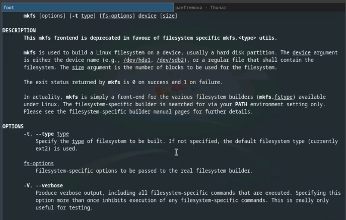{#fig:013 width=70%}

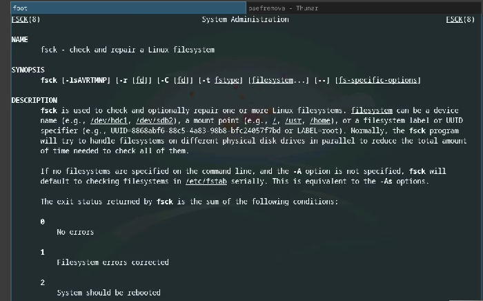{#fig:014 width=70%}

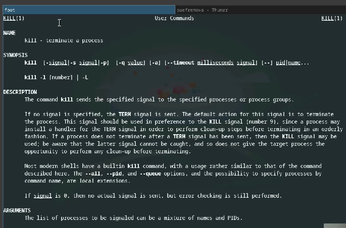{#fig:015 width=70%} 

# Выводы

Команды, представленные в данной лабораторной работе, упрощают работу с файлами и каталогами. Также не могут не пригодиться и знания в области файловых систем в целом. 

# Список литературы{.unnumbered}

1.[Лабораторная работа №7](https://esystem.rudn.ru/pluginfile.php/2586866/mod_resource/content/4/005-lab_files.pdf)

::: {#refs}
:::
