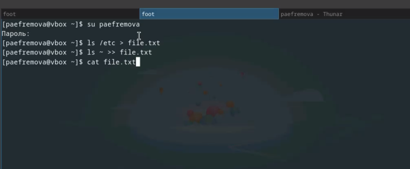
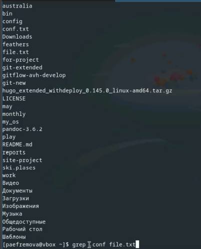
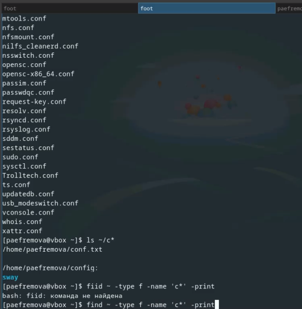
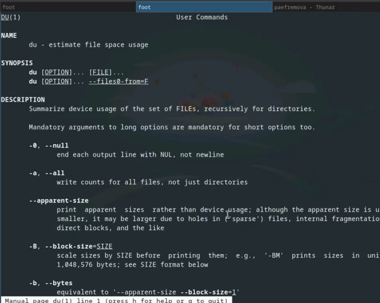
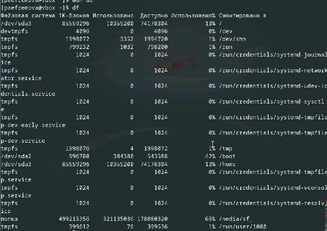

---
## Front matter
lang: ru-RU
title: Лабораторная работа №8
subtitle: Поиск файлов. Перенаправление ввода-вывода. Просмотр запущенных процессов
author:
  - Ефремова Полина Александровна
institute:
  - Российский университет дружбы народов, Москва, Россия
 
date: 24 марта 2025

## i18n babel
babel-lang: russian
babel-otherlangs: english

## Formatting pdf
toc: false
toc-title: Содержание
slide_level: 2
aspectratio: 169
section-titles: true
theme: metropolis
header-includes:
 - \metroset{progressbar=frametitle,sectionpage=progressbar,numbering=fraction}
---

# Информация

## Докладчик

:::::::::::::: {.columns align=center}
::: {.column width="70%"}

  * Ефремова Полина Александровна 
  * студент группы НКАбд-02-24
  * ст.б №1132246726
  * Российский университет дружбы народов
  * polinaefeemova68890@gmail.com
  * <https://github.com/Paefremova/>

:::
::: {.column width="30%"}

:

:::
::::::::::::::

# Вводная часть

## Актуальность

- изучение новых команд - упрощение работы с Linux

## Объект и предмет исследования

- файлы, процессы, с ними связанные 

## Цели и задачи

Ознакомление с инструментами поиска файлов и фильтрации текстовых данных.
Приобретение практических навыков: по управлению процессами (и заданиями), по
проверке использования диска и обслуживанию файловых систем.

- Поиск файлов

- Перенаправление ввода-вывода

- Просмотр запущенных процессов

# Теоретическое введение

В системе по умолчанию открыто три специальных потока:
– stdin — стандартный поток ввода (по умолчанию: клавиатура), файловый дескриптор
0;
– stdout — стандартный поток вывода (по умолчанию: консоль), файловый дескриптор
1;
– stderr — стандартный поток вывод сообщений об ошибках (по умолчанию: консоль),
файловый дескриптор 2.
Большинство используемых в консоли команд и программ записывают результаты
своей работы в стандартный поток вывода stdout. Например, команда ls выводит в стан-
дартный поток вывода (консоль) список файлов в текущей директории. Потоки вывода
и ввода можно перенаправлять на другие файлы или устройства. Проще всего это делается
с помощью символов >, >>, <, <<.

##

Конвейер (pipe) служит для объединения простых команд или утилит в цепочки, в ко-
торых результат работы предыдущей команды передаётся последующей. 

Команда find используется для поиска и отображения на экран имён файлов, соответ-
ствующих заданной строке символов.

Найти в текстовом файле указанную строку символов позволяет команда grep

Команда df показывает размер каждого смонтированного раздела диска.

# Выполнение лабораторной работы

## 1. Осуществляю вход в систему, используя соответствующее имя пользователя, записываю в файл file.txt названия файлов, содержащихся в каталоге /etc, и в домашнем каталоге (

{#fig:001 width=70%}

## 2. Здесь уже виден список этих файлов, а также вывод имен всех файлов из file.txt, имеющих расширение .conf, и записать их в новый файл conf.txt 

{#fig:002 width=70%}

##

{#fig:003 width=70%}

## 3. Определяю, какие файлы в домашнем каталоге начинаются с символа c 

{#fig:004 width=70%}

##

{#fig:005 width=70%}

## 4. Вывожу на экран (по странично) имена файлов из каталога /etc, начинающиеся с символа h, а также запускаю в фоновом режиме процесс, который будет записывать в файл 
~/logfile имена файлов, начинающихся с log 

{#fig:006 width=70%}

## 5.Запук редактора gedit в фоновом режиме, Определение идентификатора процесса gedit с помощью команды ps, конвейера и фильтра grep 

{#fig:007 width=70%}

## 6. Про df 

{#fig:008 width=70%}

## 7. Про du 

{#fig:009 width=70%}

## 8. Реализация команд df

{#fig:010 width=70%}

##

{#fig:011 width=70%}

## Выводы

Поиск файлов и перенаправление ввода-вывода достаточно интересная тема. Навыки, полученные при ее изучение могут приготиться в дальнейшей работе! 

## Список литературы

[Лабораторная №8](https://esystem.rudn.ru/pluginfile.php/2586868/mod_resource/content/4/006-lab_proc.pdf)
