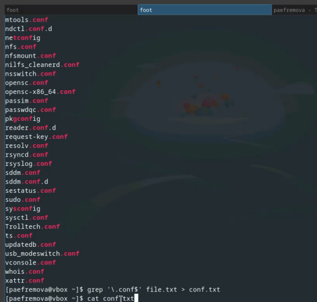
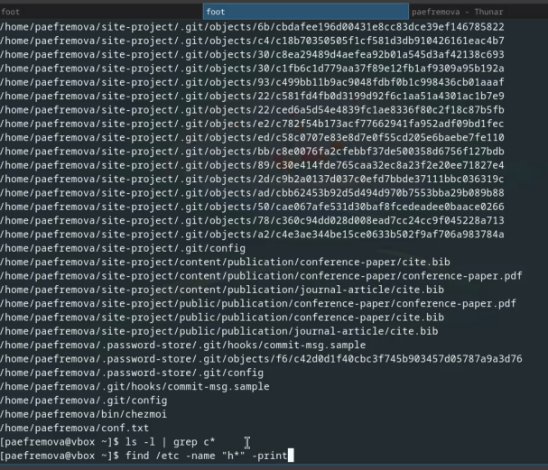
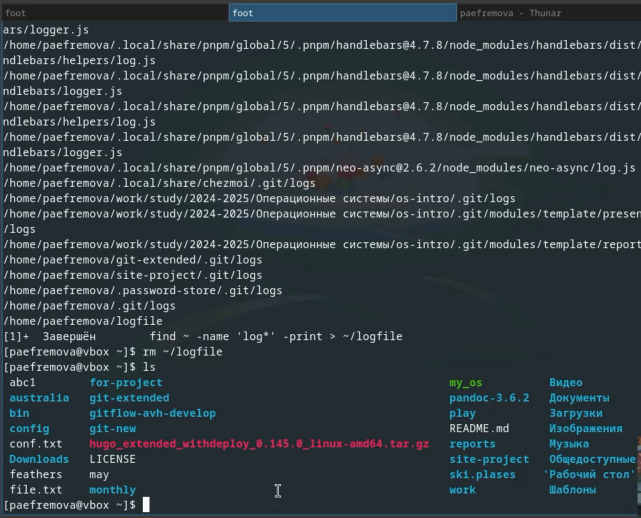
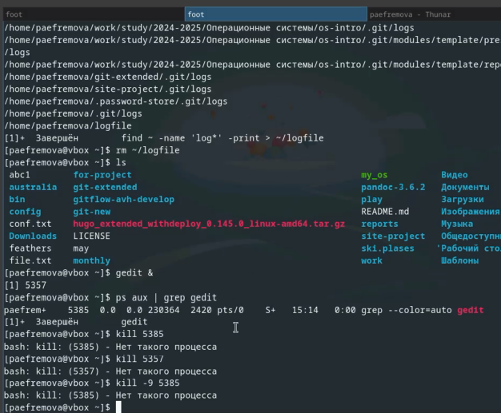
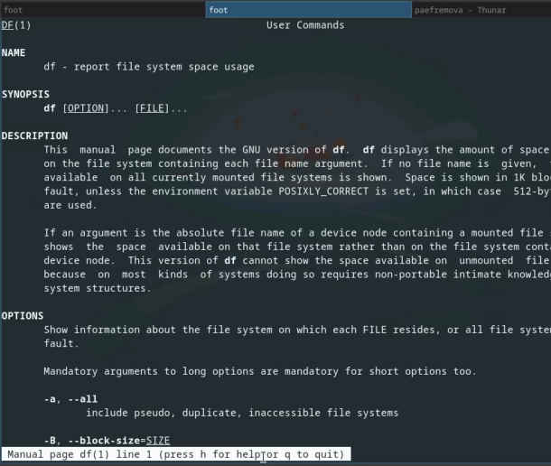
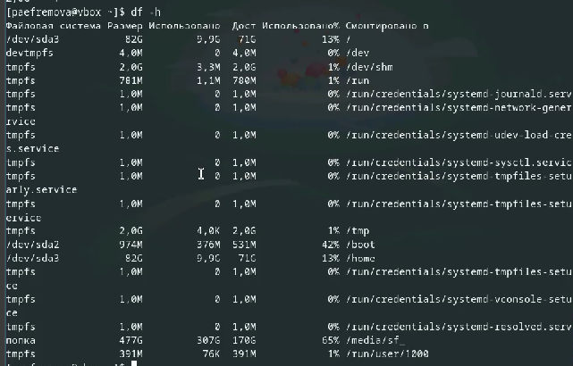

---
## Front matter
title: "Отчет по выполнению лабораторной работы №8"
subtitle: "Архитектура копмьютеров и операционные системы"
author: "Ефремова Полина Александровна"

## Generic otions
lang: ru-RU
toc-title: "Содержание"

## Bibliography
bibliography: bib/cite.bib
csl: pandoc/csl/gost-r-7-0-5-2008-numeric.csl

## Pdf output format
toc: true # Table of contents
toc-depth: 2
lof: true # List of figures
lot: true # List of tables
fontsize: 12pt
linestretch: 1.5
papersize: a4
documentclass: scrreprt
## I18n polyglossia
polyglossia-lang:
  name: russian
  options:
	- spelling=modern
	- babelshorthands=true
polyglossia-otherlangs:
  name: english
## I18n babel
babel-lang: russian
babel-otherlangs: english
## Fonts
mainfont: IBM Plex Serif
romanfont: IBM Plex Serif
sansfont: IBM Plex Sans
monofont: IBM Plex Mono
mathfont: STIX Two Math
mainfontoptions: Ligatures=Common,Ligatures=TeX,Scale=0.94
romanfontoptions: Ligatures=Common,Ligatures=TeX,Scale=0.94
sansfontoptions: Ligatures=Common,Ligatures=TeX,Scale=MatchLowercase,Scale=0.94
monofontoptions: Scale=MatchLowercase,Scale=0.94,FakeStretch=0.9
mathfontoptions:
## Biblatex
biblatex: true
biblio-style: "gost-numeric"
biblatexoptions:
  - parentracker=true
  - backend=biber
  - hyperref=auto
  - language=auto
  - autolang=other*
  - citestyle=gost-numeric
## Pandoc-crossref LaTeX customization
figureTitle: "Рис."
tableTitle: "Таблица"
listingTitle: "Листинг"
lofTitle: "Список иллюстраций"
lotTitle: "Список таблиц"
lolTitle: "Листинги"
## Misc options
indent: true
header-includes:
  - \usepackage{indentfirst}
  - \usepackage{float} # keep figures where there are in the text
  - \floatplacement{figure}{H} # keep figures where there are in the text
---

# Цель работы

Ознакомление с инструментами поиска файлов и фильтрации текстовых данных.
Приобретение практических навыков: по управлению процессами (и заданиями), по
проверке использования диска и обслуживанию файловых систем.

# Задание

- Поиск файлов

- Перенаправление ввода-вывода

- Просмотр запущенных процессов

# Теоретическое введение

В системе по умолчанию открыто три специальных потока:
– stdin — стандартный поток ввода (по умолчанию: клавиатура), файловый дескриптор
0;
– stdout — стандартный поток вывода (по умолчанию: консоль), файловый дескриптор
1;
– stderr — стандартный поток вывод сообщений об ошибках (по умолчанию: консоль),
файловый дескриптор 2.
Большинство используемых в консоли команд и программ записывают результаты
своей работы в стандартный поток вывода stdout. Например, команда ls выводит в стан-
дартный поток вывода (консоль) список файлов в текущей директории. Потоки вывода
и ввода можно перенаправлять на другие файлы или устройства. Проще всего это делается
с помощью символов >, >>, <, <<.

Конвейер (pipe) служит для объединения простых команд или утилит в цепочки, в ко-
торых результат работы предыдущей команды передаётся последующей. 

Команда find используется для поиска и отображения на экран имён файлов, соответ-
ствующих заданной строке символов.

Найти в текстовом файле указанную строку символов позволяет команда grep

Команда df показывает размер каждого смонтированного раздела диска.

# Выполнение лабораторной работы

1. Осуществляю вход в систему, используя соответствующее имя пользователя, записываю в файл file.txt названия файлов, содержащихся в каталоге /etc, и в домашнем каталоге (рис. [-@fig:001]).

{#fig:001 width=70%}

2. Здесь уже виден список этих файлов, а также вывод имен всех файлов из file.txt, имеющих расширение .conf, и записать их в новый файл conf.txt (рис. [-@fig:002]). (рис. [-@fig:003]).

{#fig:002 width=70%}

{#fig:003 width=70%}

3. Определяю, какие файлы в домашнем каталоге начинаются с символа c (рис. [-@fig:004]). (рис. [-@fig:005]).

{#fig:004 width=70%}

{#fig:005 width=70%}

4. Вывожу на экран (по странично) имена файлов из каталога /etc, начинающиеся с символа h, а также запускаю в фоновом режиме процесс, который будет записывать в файл 
~/logfile имена файлов, начинающихся с log (рис. [-@fig:006]).

{#fig:006 width=70%}

5.Запук редактора gedit в фоновом режиме, Определение идентификатора процесса gedit с помощью команды ps, конвейера и фильтра grep (рис. [-@fig:007]).

{#fig:007 width=70%}

6. Про df (рис. [-@fig:008]).

{#fig:008 width=70%}

7. Про du (рис. [-@fig:009]).

{#fig:009 width=70%}

8. Реализация команд df (рис. [-@fig:010]). (рис. [-@fig:011]).

{#fig:010 width=70%}

{#fig:011 width=70%}

# Выводы

Поиск файлов и перенаправление ввода-вывода достаточно интересная тема. Навыки, полученные при ее изучение могут приготиться в дальнейшей работе! 

# Список литературы

[Лабораторная №8](https://esystem.rudn.ru/pluginfile.php/2586868/mod_resource/content/4/006-lab_proc.pdf)
