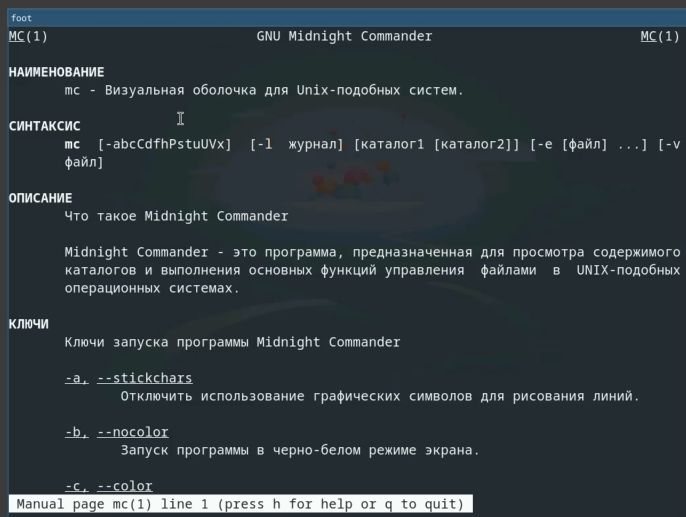
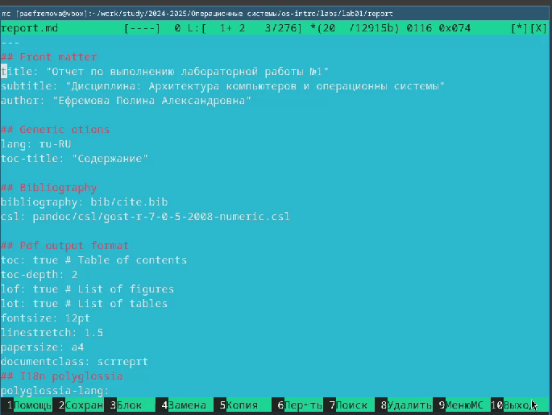
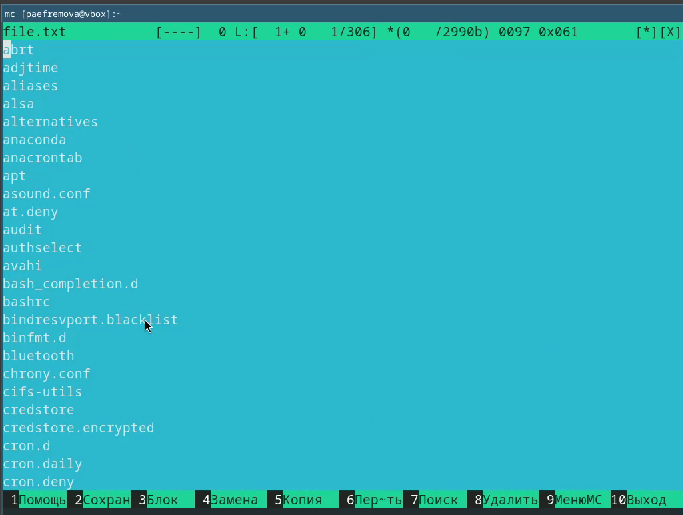
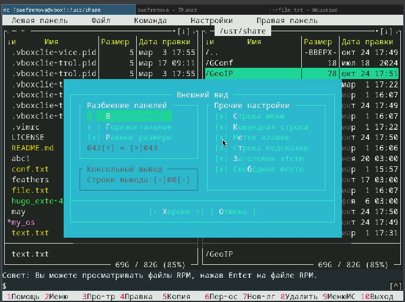

---
## Front matter
lang: ru-RU
title: Лабораторная работа №9
subtitle: 
author:
  - Ефремова Полина Александровна
institute:
  - Российский университет дружбы народов, Москва, Россия
 
date: 7 апреля 2025

## i18n babel
babel-lang: russian
babel-otherlangs: english

## Formatting pdf
toc: false
toc-title: Содержание
slide_level: 2
aspectratio: 169
section-titles: true
theme: metropolis
header-includes:
 - \metroset{progressbar=frametitle,sectionpage=progressbar,numbering=fraction}
---

# Информация

## Докладчик

:::::::::::::: {.columns align=center}
::: {.column width="70%"}

  * Ефремова Полина Александровна 
  * студент группы НКАбд-02-24
  * ст.б №1132246726
  * Российский университет дружбы народов
  * polinaefeemova68890@gmail.com
  * <https://github.com/Paefremova/>

:::
::: {.column width="30%"}

:

:::
::::::::::::::

# Вводная часть

## Актуальность

- упрощает работу с фаловыми системами 

## Объект и предмет исследования

- mc

## Цели и задачи

Освоение основных возможностей командной оболочки Midnight Commander. Приоб-
ретение навыков практической работы по просмотру каталогов и файлов; манипуляций
с ними.

## Выполнение лабораторной работы

1. Изучить информацию о mc, вызвав в командной строке man mc. 

{#fig:001 width=70%}

## 2. Выполняю несколько операций в mc, используя управляющие клавиши (операции
с панелями; выделение/отмена выделения файлов, копирование/перемещение фай-
лов, получение информации о размере и правах доступа на файлы и/или каталоги
и т.п. Выполняю основные команды меню левой (или правой) панели. 

##

{#fig:002 width=50%}

## 3. Используя возможности подменю Файл , выполнияю:
– просмотр содержимого текстового файла;
– редактирование содержимого текстового файла (без сохранения результатов
редактирования);
– создание каталога;
– копирование в файлов в созданный каталог  

##

{#fig:003 width=70%}

## 4. С помощью соответствующих средств подменю Команда осуществляю:
– поиск в файловой системе файла с заданными условиями (например, файла
с расширением .c или .cpp, содержащего строку main);
– выбор и повторение одной из предыдущих команд;
– переход в домашний каталог;
– анализ файла меню и файла расширений.
Вызоваю  подменю Настройки . Осваиваю операции, определяющие структуру экрана mc
(Full screen, Double Width, Show Hidden Files и т.д.) 

##

{#fig:004 width=70%}

## 5. Создаю текстовой файл text.txt.Откройте этот файл с помощью встроенного в mc редактора. Вставьте в открытый файл небольшой фрагмент текста, скопированный из любого
другого файла или Интернета. Проделайте с текстом следующие манипуляции, используя горячие клавиши:Удалите строку текста.Выделите фрагмент текста и скопируйте его на новую строку. Выделите фрагмент текста и перенесите его на новую строку.Сохраните файл. Отмените последнее действие.
 Перейдите в конец файла (нажав комбинацию клавиш) и напишите некоторый
текст. Перейдите в начало файла (нажав комбинацию клавиш) и напишите некоторый
текст. Сохраните и закройте файл рис. 

##

{#fig:005 width=70%}

## 6. Используя меню редактора, включаю подсветку синтаксиса, если она не включена,
или выключите, если она включена.

##

{#fig:006 width=70%}

## Выводы

Работа с mc несложная, теперь освоен еще один коммандер, позволяющий работать с файловой системой. 

## Список литературы{.unnumbered}

1. [Лабораторная работа №7](https://esystem.rudn.ru/pluginfile.php/2586870/mod_resource/content/5/007-lab_mc.pdf)
