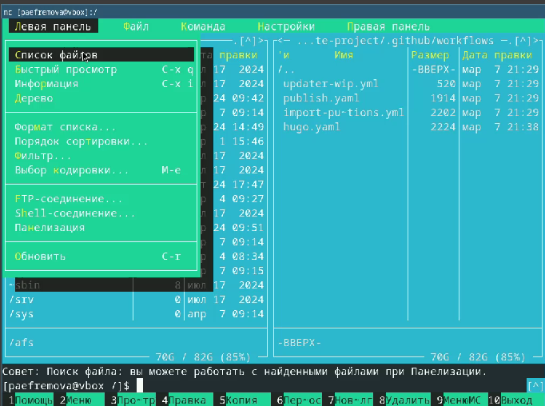
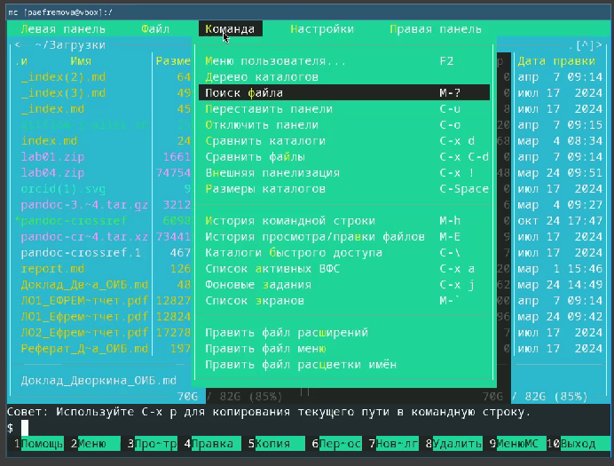

---
## Front matter
title: "Отчет по выполнению лабораторной работы №9"
subtitle: "Дисциплина: Архитектура компьютеров и операционные системы"
author: "Ефремова Полина Александровна"

## Generic otions
lang: ru-RU
toc-title: "Содержание"

## Bibliography
bibliography: bib/cite.bib
csl: pandoc/csl/gost-r-7-0-5-2008-numeric.csl

## Pdf output format
toc: true # Table of contents
toc-depth: 2
lof: true # List of figures
lot: true # List of tables
fontsize: 12pt
linestretch: 1.5
papersize: a4
documentclass: scrreprt
## I18n polyglossia
polyglossia-lang:
  name: russian
  options:
	- spelling=modern
	- babelshorthands=true
polyglossia-otherlangs:
  name: english
## I18n babel
babel-lang: russian
babel-otherlangs: english
## Fonts
mainfont: IBM Plex Serif
romanfont: IBM Plex Serif
sansfont: IBM Plex Sans
monofont: IBM Plex Mono
mathfont: STIX Two Math
mainfontoptions: Ligatures=Common,Ligatures=TeX,Scale=0.94
romanfontoptions: Ligatures=Common,Ligatures=TeX,Scale=0.94
sansfontoptions: Ligatures=Common,Ligatures=TeX,Scale=MatchLowercase,Scale=0.94
monofontoptions: Scale=MatchLowercase,Scale=0.94,FakeStretch=0.9
mathfontoptions:
## Biblatex
biblatex: true
biblio-style: "gost-numeric"
biblatexoptions:
  - parentracker=true
  - backend=biber
  - hyperref=auto
  - language=auto
  - autolang=other*
  - citestyle=gost-numeric
## Pandoc-crossref LaTeX customization
figureTitle: "Рис."
tableTitle: "Таблица"
listingTitle: "Листинг"
lofTitle: "Список иллюстраций"
lotTitle: "Список таблиц"
lolTitle: "Листинги"
## Misc options
indent: true
header-includes:
  - \usepackage{indentfirst}
  - \usepackage{float} # keep figures where there are in the text
  - \floatplacement{figure}{H} # keep figures where there are in the text
---

# Цель работы

Освоение основных возможностей командной оболочки Midnight Commander. Приоб-
ретение навыков практической работы по просмотру каталогов и файлов; манипуляций
с ними.

# Задание

В соответствии с рекомандациями, выполнить ращные команды в mc

# Теоретическое введение

Командная оболочка — интерфейс взаимодействия пользователя с операционной систе-
мой и программным обеспечением посредством команд.
Midnight Commander (или mc) — псевдографическая командная оболочка для UNIX/Linux
систем. Для запуска mc необходимо в командной строке набрать mc и нажать Enter .
Рабочее пространство mc имеет две панели, отображающие по умолчанию списки
файлов двух каталогов 

Панель в mc отображает список файлов текущего каталога. Абсолютный путь к этому
каталогу отображается в заголовке панели. У активной панели заголовок и одна из её
строк подсвечиваются. Управление панелями осуществляется с помощью определённых
комбинаций клавиш или пунктов меню mc.
Панели можно поменять местами. Для этого и используется комбинация клавиш Ctrl-u
или команда меню mc Переставить панели . Также можно временно убрать отображение
панелей (отключить их) с помощью комбинации клавиш Ctrl-o или команды меню mc
Отключить панели . Это может быть полезно, например, если необходимо увидеть вывод
какой-то информации на экран после выполнения какой-либо команды shell.
С помощью последовательного применения комбинации клавиш Ctrl-x d есть
возможность сравнения каталогов, отображённых на двух панелях. Панели могут допол-
нительно быть переведены в один из двух режимов: Информация или Дерево . В режиме
Информация  на панель выводятся сведения о файле и текущей файловой системе,
расположенных на активной панели. В режиме Дерево на одной из панелей
выводится структура дерева каталогов.

Управлять режимами отображения панелей можно через пункты меню mc Правая панель
и Левая панель

# Выполнение лабораторной работы

1. Изучить информацию о mc, вызвав в командной строке man mc. (рис. [-@fig:001]).

{#fig:001 width=70%}

2. Выполняю несколько операций в mc, используя управляющие клавиши (операции
с панелями; выделение/отмена выделения файлов, копирование/перемещение фай-
лов, получение информации о размере и правах доступа на файлы и/или каталоги
и т.п. Выполняю основные команды меню левой (или правой) панели. (рис. [-@fig:002]).

{#fig:002 width=70%}

3. Используя возможности подменю Файл , выполнияю:
– просмотр содержимого текстового файла;
– редактирование содержимого текстового файла (без сохранения результатов
редактирования);
– создание каталога;
– копирование в файлов в созданный каталог  (рис. [-@fig:003]).

{#fig:003 width=70%}

4. С помощью соответствующих средств подменю Команда осуществляю:
– поиск в файловой системе файла с заданными условиями (например, файла
с расширением .c или .cpp, содержащего строку main);
– выбор и повторение одной из предыдущих команд;
– переход в домашний каталог;
– анализ файла меню и файла расширений.
Вызоваю  подменю Настройки . Осваиваю операции, определяющие структуру экрана mc
(Full screen, Double Width, Show Hidden Files и т.д.) (рис. [-@fig:004]).

{#fig:004 width=70%}

5. Создаю текстовой файл text.txt.Откройте этот файл с помощью встроенного в mc редактора. Вставьте в открытый файл небольшой фрагмент текста, скопированный из любого
другого файла или Интернета. Проделайте с текстом следующие манипуляции, используя горячие клавиши:Удалите строку текста.Выделите фрагмент текста и скопируйте его на новую строку. Выделите фрагмент текста и перенесите его на новую строку.Сохраните файл. Отмените последнее действие.
 Перейдите в конец файла (нажав комбинацию клавиш) и напишите некоторый
текст. Перейдите в начало файла (нажав комбинацию клавиш) и напишите некоторый
текст. Сохраните и закройте файл рис. [-@fig:005]).

{#fig:005 width=70%}

6. Используя меню редактора, включаю подсветку синтаксиса, если она не включена,
или выключите, если она включена. [-@fig:006]).

{#fig:006 width=70%}

# Выводы

Работа с mc несложная, теперь освоен еще один коммандер, позволяющий работать с файловой системой. 

# Список литературы{.unnumbered}

1. [Лабораторная работа №7](https://esystem.rudn.ru/pluginfile.php/2586870/mod_resource/content/5/007-lab_mc.pdf)ЙЙЯЦйЙЙ

::: {#refs}
:::
