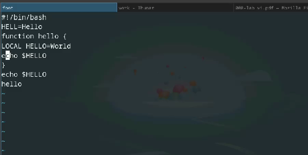

---
## Front matter
lang: ru-RU
title: Лабораторная работа №10
subtitle: 
author:
  - Ефремова Полина Александровна
institute:
  - Российский университет дружбы народов, Москва, Россия
 
date: 12 апреля 2025

## i18n babel
babel-lang: russian
babel-otherlangs: english

## Formatting pdf
toc: false
toc-title: Содержание
slide_level: 2
aspectratio: 169
section-titles: true
theme: metropolis
header-includes:
 - \metroset{progressbar=frametitle,sectionpage=progressbar,numbering=fraction}
---

# Информация

## Докладчик

:::::::::::::: {.columns align=center}
::: {.column width="70%"}

  * Ефремова Полина Александровна 
  * студент группы НКАбд-02-24
  * ст.б №1132246726
  * Российский университет дружбы народов
  * polinaefeemova68890@gmail.com
  * <https://github.com/Paefremova/>

:::
::: {.column width="30%"}

:

:::
::::::::::::::

# Вводная часть

## Актуальность

Навыки работы с текстовыми редакторами 

## Объект и предмет исследования

Текстовый редактор vi 

## Цели и задачи

1. Ознакомиться с теоретическим материалом.
2. Ознакомиться с редактором vi.
3. Выполнить упражнения, используя команды vi.

## Теоретическое введение

В большинстве дистрибутивов Linux в качестве текстового редактора по умолчанию
устанавливается интерактивный экранный редактор vi (Visual display editor).
Редактор vi имеет три режима работы:
– командный режим — предназначен для ввода команд редактирования и навигации по
редактируемому файлу;
– режим вставки — предназначен для ввода содержания редактируемого файла;
– режим последней (или командной) строки — используется для записи изменений в файл
и выхода из редактора.
Для вызова редактора vi необходимо указать команду vi и имя редактируемого файла:
vi <имя_файла>
При этом в случае отсутствия файла с указанным именем будет создан такой файл.
Переход в командный режим осуществляется нажатием клавиши Esc . Для выхода из
редактора vi необходимо перейти в режим последней строки: находясь в командном
режиме, нажать Shift-; (по сути символ : — двоеточие), затем:
– набрать символы wq, если перед выходом из редактора требуется записать изменения
в файл;
– набрать символ q (или q!), если требуется выйти из редактора без сохранен

## Выполнение лабораторной работы 

##

Создаю каталог с именем ~/work/os/lab06, Перехожу во вновь созданный каталог. Вызываю vi и создаю файл hello.sh 

{#fig:001 width=70%}

##

Выполняю различные команды во время работыс текстом, который я добавила в созданный файл (из ТУИС).

{#fig:002 width=70%}

##

Уже существующий файл изменяю: добваляю новые строки, удаляю старые, заменяю существующие на новые, переношу курсор в различные части текста и тп.
 
{#fig:003 width=70%}

## Выводы

Благодаря данной работе получены навыки владения еще одним редактором - vi. 

## Список литературы{.unnumbered}

[Лабораторная работа №10](https://esystem.rudn.ru/pluginfile.php/2586872/mod_resource/content/4/008-lab_vi.pdf) 

