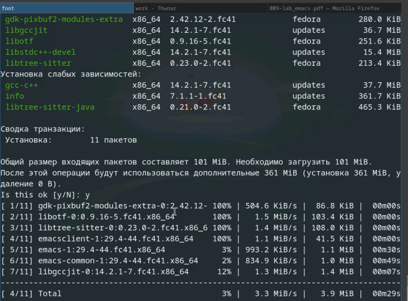
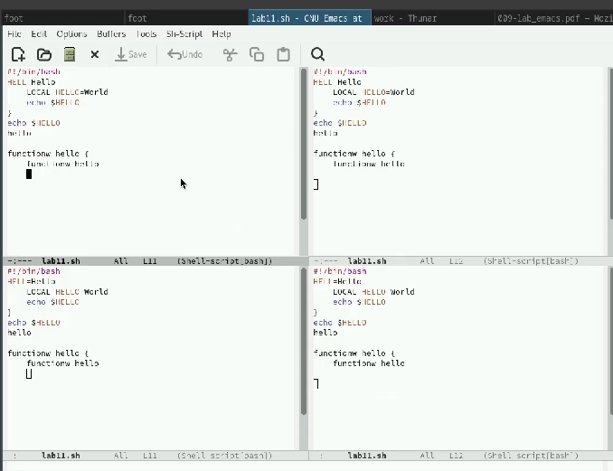

---
## Front matter
lang: ru-RU
title: Лабораторная работа №11
subtitle: 
author:
  - Ефремова Полина Александровна
institute:
  - Российский университет дружбы народов, Москва, Россия
 
date: 12 апреля 2025

## i18n babel
babel-lang: russian
babel-otherlangs: english

## Formatting pdf
toc: false
toc-title: Содержание
slide_level: 2
aspectratio: 169
section-titles: true
theme: metropolis
header-includes:
 - \metroset{progressbar=frametitle,sectionpage=progressbar,numbering=fraction}
---

# Информация

## Докладчик

:::::::::::::: {.columns align=center}
::: {.column width="70%"}

  * Ефремова Полина Александровна 
  * студент группы НКАбд-02-24
  * ст.б №1132246726
  * Российский университет дружбы народов
  * polinaefeemova68890@gmail.com
  * <https://github.com/Paefremova/>

:::
::: {.column width="30%"}

:

:::
::::::::::::::

# Вводная часть

## Объект и предмет исследования

Текстовый редкотор emacs 

## Цели и задачи

1. Ознакомиться с теоретическим материалом.
2. Ознакомиться с редактором emacs.
3. Выполнить упражнения.
4. Ответить на контрольные вопросы.

## Теоретическое введение 

Emacs представляет собой мощный экранный редактор текста, написанный на языке
высокого уровня Elisp

**Определение 1.** Буфер — объект, представляющий какой-либо текст.
Буфер может содержать что угодно, например, результаты компиляции программы
или встроенные подсказки. Практически всё взаимодействие с пользователем, в том
числе интерактивное, происходит посредством буферов.

**Определение 2.** Фрейм соответствует окну в обычном понимании этого слова. Каждый
фрейм содержит область вывода и одно или несколько окон Emacs.

##

**Определение 3.** Окно — прямоугольная область фрейма, отображающая один из буфе-
ров.
Каждое окно имеет свою строку состояния, в которой выводится следующая информа-
ция: название буфера, его основной режим, изменялся ли текст буфера и как далеко вниз
по буферу расположен курсор. Каждый буфер находится только в одном из возможных
основных режимов. Существующие основные режимы включают режим Fundamental
(наименее специализированный), режим Text, режим Lisp, режим С, режим Texinfo
и другие. Под второстепенными режимами понимается список режимов, которые вклю-
чены в данный момент в буфере выбранного окна.

##

**Определение 4.** Область вывода — одна или несколько строк внизу фрейма, в которой
Emacs выводит различные сообщения, а также запрашивает подтверждения и дополни-
тельную информацию от пользователя.

**Определение 5.** Минибуфер используется для ввода дополнительной информации и все-
гда отображается в области вывода.

**Определение 6.** Точка вставки — место вставки (удаления) данных в буфере.

## Выполнение лабораторной работы

Устанавливаю Emacs 

{#fig:001 width=70%}

##

Набираю данный на ТУис текст 

{#fig:002 width=70%}

##

Выполняю множество разных команд, данных в лабораторной работе в виде заданий. Выполняю различную работу с текстом: копирование, выделение, поиск слов в тексте и тп. На даном рисунке создаю еще 3 дополнительных окна для работы 

{#fig:003 width=70%}

## Выводы

Получены навыки работы с новым текстовым редактором - emax

## Список литературы

[Лабораторная работа №11](https://esystem.rudn.ru/pluginfile.php/2586874/mod_resource/content/5/009-lab_emacs.pdf)

