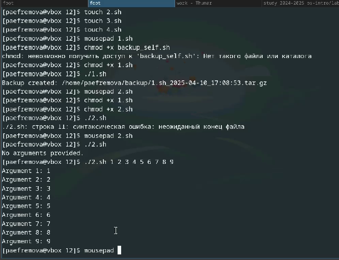
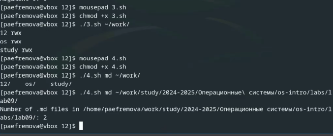

---
## Front matter
lang: ru-RU
title: Лабораторная работа №12
subtitle: 
author:
  - Ефремова Полина Александровна
institute:
  - Российский университет дружбы народов, Москва, Россия
 
date: 12 апреля 2025

## i18n babel
babel-lang: russian
babel-otherlangs: english

## Formatting pdf
toc: false
toc-title: Содержание
slide_level: 2
aspectratio: 169
section-titles: true
theme: metropolis
header-includes:
 - \metroset{progressbar=frametitle,sectionpage=progressbar,numbering=fraction}
---

# Информация

## Докладчик

:::::::::::::: {.columns align=center}
::: {.column width="70%"}

  * Ефремова Полина Александровна 
  * студент группы НКАбд-02-24
  * ст.б №1132246726
  * Российский университет дружбы народов
  * polinaefeemova68890@gmail.com
  * <https://github.com/Paefremova/>

:::
::: {.column width="30%"}

:

:::
::::::::::::::

# Вводная часть

## Актуальность

новые навыки

## Объект и предмет исследования

 ОС UNIX/Linux.

## Цели и задачи

1. Написать скрипт, который при запуске будет делать резервную копию самого себя (то
есть файла, в котором содержится его исходный код) в другую директорию backup
в вашем домашнем каталоге. При этом файл должен архивироваться одним из ар-
хиваторов на выбор zip, bzip2 или tar. Способ использования команд архивации
необходимо узнать, изучив справку.

##

2. Написать пример командного файла, обрабатывающего любое произвольное число
аргументов командной строки, в том числе превышающее десять. Например, скрипт
может последовательно распечатывать значения всех переданных аргументов.

##

3. Написать командный файл — аналог команды ls (без использования самой этой ко-
манды и команды dir). Требуется, чтобы он выдавал информацию о нужном каталоге
и выводил информацию о возможностях доступа к файлам этого каталога.

##

4. Написать командный файл, который получает в качестве аргумента командной строки
формат файла (.txt, .doc, .jpg, .pdf и т.д.) и вычисляет количество таких файлов
в указанной директории. Путь к директории также передаётся в виде аргумента ко-
мандной строки.


## Теория! 

Командный процессор (командная оболочка, интерпретатор команд shell) — это про-
грамма, позволяющая пользователю взаимодействовать с операционной системой
компьютера. В операционных системах типа UNIX/Linux наиболее часто используются
следующие реализации командных оболочек:

– оболочка Борна (Bourne shell или sh) — стандартная командная оболочка UNIX/Linux,
содержащая базовый, но при этом полный набор функций;

##

– С-оболочка (или csh) — надстройка на оболочкой Борна, использующая С-подобный
синтаксис команд с возможностью сохранения истории выполнения команд;
– оболочка Корна (или ksh) — напоминает оболочку С, но операторы управления програм-
мой совместимы с операторами оболочки Борна;
– BASH — сокращение от Bourne Again Shell (опять оболочка Борна), в основе своей сов-
мещает свойства оболочек С и Корна (разработка компании Free Software Foundation).

##

POSIX (Portable Operating System Interface for Computer Environments) — набор стандартов
описания интерфейсов взаимодействия операционной системы и прикладных программ.
Стандарты POSIX разработаны комитетом IEEE (Institute of Electrical and Electronics
Engineers) для обеспечения совместимости различных UNIX/Linux-подобных опера-
ционных систем и переносимости прикладных программ на уровне исходного кода.
POSIX-совместимые оболочки разработаны на базе оболочки Корна.
Рассмотрим основные элементы программирования в оболочке bash. В других оболоч-
ках большинство команд будет совпадать с описанными ниже.

## Реализация заданий

1. Выполнение задания 1  и 2

Код 1:

```

#!/bin/bash

BACKUP_DIR="$HOME/backup"
mkdir -p "$BACKUP_DIR"
SCRIPT_NAME=$(basename "$0")
cp "$0" "$BACKUP_DIR/${SCRIPT_NAME}_$(date +%F_%T).tar.gz"
tar -czf "$BACKUP_DIR/${SCRIPT_NAME}_$(date +%F_%T).tar.gz" "$0"
echo "Backup created: $BACKUP_DIR/${SCRIPT_NAME}_$(date +%F_%T).tar.gz"
```

##

Код 2:

```
#!/bin/bash

if [ "$#" -eq 0 ]; then
    echo "No arguments provided."
else
    i=1
    for arg in "$@"; do
        echo "Argument $i: $arg"
        ((i++))
    done
fi
```

## Реализация 1 и 2 кода.  

{#fig:001 width=70%}

## 2. Выполнение заданий 3 и 4 

Код 3:

```
#!/bin/bash

TARGET_DIR="${1:-.}"
if [ ! -d "$TARGET_DIR" ]; then
    echo "Error: $TARGET_DIR is not a directory."
    exit 1
fi
for FILE in "$TARGET_DIR"/*; do
    [ -e "$FILE" ] || continue
    echo -n "$(basename "$FILE") "
    [ -r "$FILE" ] && echo -n "r" || echo -n "-"
    [ -w "$FILE" ] && echo -n "w" || echo -n "-"
    [ -x "$FILE" ] && echo -n "x" || echo -n "-"
    echo ""
done
```

##

Код 4:

```

#!/bin/bash

if [ "$#" -lt 2 ]; then
    echo "Usage: $0 <extension> <directory>"
    exit 1
fi
EXTENSION="$1"
DIRECTORY="$2"
if [ ! -d "$DIRECTORY" ]; then
    echo "Error: $DIRECTORY is not a directory."
    exit 1
fi
COUNT=$(find "$DIRECTORY" -type f -name "*.$EXTENSION" | wc -l)
echo "Number of .$EXTENSION files in $DIRECTORY: $COUNT"
```

## Реализация 3 и 4 кода 

{#fig:002 width=70%}

## Выводы

Я научилась писать небольшие командные файлы 

## Список литературы{.unnumbered}

[Лабораторная работа №12](https://esystem.rudn.ru/pluginfile.php/2586876/mod_resource/content/4/010-lab_shell_prog_1.pdf)
