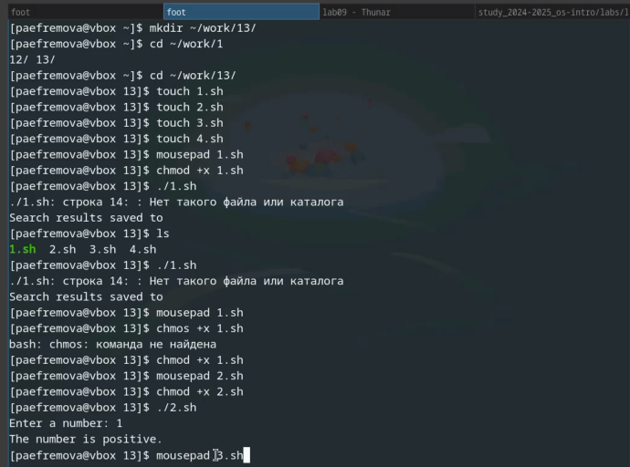
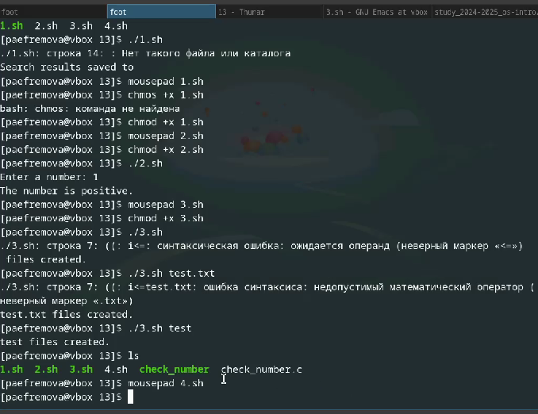

---
## Front matter
title: "Отчет по выполнению лабораторной работы №13"
subtitle: "Архитектура компьютеров и операционные системы"
author: "Ефремова Полина Александровна"

## Generic otions
lang: ru-RU
toc-title: "Содержание"

## Bibliography
bibliography: bib/cite.bib
csl: pandoc/csl/gost-r-7-0-5-2008-numeric.csl

## Pdf output format
toc: true # Table of contents
toc-depth: 2
lof: true # List of figures
lot: true # List of tables
fontsize: 12pt
linestretch: 1.5
papersize: a4
documentclass: scrreprt
## I18n polyglossia
polyglossia-lang:
  name: russian
  options:
	- spelling=modern
	- babelshorthands=true
polyglossia-otherlangs:
  name: english
## I18n babel
babel-lang: russian
babel-otherlangs: english
## Fonts
mainfont: IBM Plex Serif
romanfont: IBM Plex Serif
sansfont: IBM Plex Sans
monofont: IBM Plex Mono
mathfont: STIX Two Math
mainfontoptions: Ligatures=Common,Ligatures=TeX,Scale=0.94
romanfontoptions: Ligatures=Common,Ligatures=TeX,Scale=0.94
sansfontoptions: Ligatures=Common,Ligatures=TeX,Scale=MatchLowercase,Scale=0.94
monofontoptions: Scale=MatchLowercase,Scale=0.94,FakeStretch=0.9
mathfontoptions:
## Biblatex
biblatex: true
biblio-style: "gost-numeric"
biblatexoptions:
  - parentracker=true
  - backend=biber
  - hyperref=auto
  - language=auto
  - autolang=other*
  - citestyle=gost-numeric
## Pandoc-crossref LaTeX customization
figureTitle: "Рис."
tableTitle: "Таблица"
listingTitle: "Листинг"
lofTitle: "Список иллюстраций"
lotTitle: "Список таблиц"
lolTitle: "Листинги"
## Misc options
indent: true
header-includes:
  - \usepackage{indentfirst}
  - \usepackage{float} # keep figures where there are in the text
  - \floatplacement{figure}{H} # keep figures where there are in the text
---

# Цель работы

Изучить основы программирования в оболочке ОС UNIX. Научится писать более
сложные командные файлы с использованием логических управляющих конструкций
и циклов.

# Задание

1. Используя команды getopts grep, написать командный файл, который анализирует
командную строку с ключами:
– -iinputfile — прочитать данные из указанного файла;
– -ooutputfile — вывести данные в указанный файл;
– -pшаблон — указать шаблон для поиска;
– -C — различать большие и малые буквы;
– -n — выдавать номера строк.
а затем ищет в указанном файле нужные строки, определяемые ключом -p.

2. Написать на языке Си программу, которая вводит число и определяет, является ли оно
больше нуля, меньше нуля или равно нулю. Затем программа завершается с помощью
функции exit(n), передавая информацию в о коде завершения в оболочку. Команд-
ный файл должен вызывать эту программу и, проанализировав с помощью команды
$?, выдать сообщение о том, какое число было введено.

3. Написать командный файл, создающий указанное число файлов, пронумерованных
последовательно от 1 до 𝑁 (например 1.tmp, 2.tmp, 3.tmp,4.tmp и т.д.). Число файлов,
которые необходимо создать, передаётся в аргументы командной строки. Этот же ко-
мандный файл должен уметь удалять все созданные им файлы (если они существуют).


4. Написать командный файл, который с помощью команды tar запаковывает в архив
все файлы в указанной директории. Модифицировать его так, чтобы запаковывались
только те файлы, которые были изменены менее недели тому назад (использовать
команду find).


# Выполнение лабораторной работы

1. Выполнение задания 1  и 2

Код 1:

```

#!/bin/bash

case_sensitive="-i"  # по умолчанию — нечувствительный поиск
line_numbers=""

while getopts "i:o:p:Cn" opt; do
    case "$opt" in
        i) inputfile="$OPTARG" ;;
        o) outputfile="$OPTARG" ;;
        p) pattern="$OPTARG" ;;
        C) case_sensitive="" ;;   # чувствительный к регистру поиск
        n) line_numbers="-n" ;;
        *) echo "Usage: $0 -i inputfile -o outputfile -p pattern [-C] [-n]"; exit 1 ;;
    esac
done

# Проверка обязательных аргументов
if [[ -z "$inputfile" || -z "$pattern" ]]; then
    echo "Необходимо указать -i inputfile и -p pattern"
    exit 1
fi

# Выполнение поиска
if [[ -n "$outputfile" ]]; then
    grep $case_sensitive $line_numbers "$pattern" "$inputfile" > "$outputfile"
    echo "Результат сохранён в $outputfile"
else
    grep $case_sensitive $line_numbers "$pattern" "$inputfile"
fi
```

Код 2:

```

#!/bin/bash

cat << EOF > check_number.c
#include <stdio.h>
#include <stdlib.h>

int main() {
    int num;
    printf("Enter a number: ");
    scanf("%d", &num);
    if (num > 0) exit(1);
    if (num < 0) exit(2);
    exit(0);
}
EOF

gcc check_number.c -o check_number
./check_number
status=$?
if [ $status -eq 1 ]; then
    echo "The number is positive."
elif [ $status -eq 2 ]; then
    echo "The number is negative."\else
    echo "The number is zero."
fi
```

Реализация 1 и 2 кода.  (рис. [-@fig:001]).

{#fig:001 width=70%}

2. Выполнение заданий 3 и 4 

Код 3:

```

#!/bin/bash

if [ "$1" = "delete" ]; then
    rm -f *.tmp
    echo "All .tmp files deleted."
else
    for ((i=1; i<=$1; i++)); do
        touch "$i.tmp"
    done
    echo "$1 files created."
fi
```

Код 4:

```

#!/bin/bash

if [ "$1" = "modified" ]; then
    tar -czf archive.tar.gz $(find "$2" -type f -mtime -7)
    echo "Archived modified files from $2."
else
    tar -czf archive.tar.gz -C "$1" .
    echo "All files in $1 archived."
fi
```

Реализация 3 и 4 кода (рис. [-@fig:002]).

{#fig:002 width=70%}


# Выводы

Здесь кратко описываются итоги проделанной работы.

# Список литературы{.unnumbered}

[Лабораторная №13](https://esystem.rudn.ru/pluginfile.php/2586878/mod_resource/content/5/011-lab_shell_prog_2.pdf)
