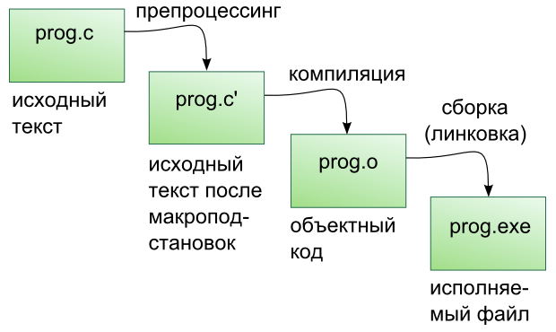
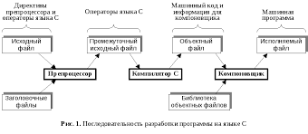
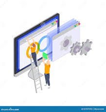

---
## Front matter
lang: ru-RU
title: Этапы обработки команды от исходного кода к исполняемому в операционных системах
subtitle: Архитектура компьютеров и операционные системы 
author:
  - Ефремова Полина Александровна
institute:
  - Российский университет дружбы народов, Москва, Россия
 
date: 06 марта 2025

## i18n babel
babel-lang: russian
babel-otherlangs: english

## Formatting pdf
toc: false
toc-title: Содержание
slide_level: 2
aspectratio: 169
section-titles: true
theme: metropolis
header-includes:
 - \metroset{progressbar=frametitle,sectionpage=progressbar,numbering=fraction}
---

# Информация

## Докладчик

:::::::::::::: {.columns align=center}
::: {.column width="70%"}

  * Ефремова Полина Александровна 
  * студент группы НКАбд-02-24
  * ст.б №1132246726
  * Российский университет дружбы народов
  * polinaefeemova68890@gmail.com
  * <https://github.com/Paefremova/>

:::
::: {.column width="30%"}

:

:::
::::::::::::::

## Основные понятия

- Исходный код

- Обработка программы 

- Исполняемый файл

- Объектный код 

## Этапы обработки программы

## Предварительная обработка (Preprocessing)

- обработка директивы препроцессора

## Компиляция (Compilation)

- анализ синтаксиса и семантики кода, проверка его на наличие ошибок и преобравание его в ассемблерный код

## Ассемблирование (Assembly)

- Ассемблерный код преобразуется в объектный код (машинный код), который может быть выполнен процессором. 

## Компоновка (Linking)

- Объединение кода из различных модулей и библиотек, а также разрешение всех символов и адресов.

## Что происходит после компоновки: 

-  Создание исполняемого файла

-  Загрузка программы в память

-  Исполнение программы

-  Завершение работы программы

## Заключение

Процесс обработки программы от исходного кода до исполняемого файла представляет собой сложный и многослойный процесс. 
Он включает в себя несколько ключевых этапов, таких как препроцессинг, компиляция, ассемблирование, линковка и загрузка в память. 
Каждый из этих этапов играет важную роль в создании работающего программного продукта, который может быть использован пользователями и взаимодействовать с операционной системой.

## Список литературы{.unnumbered}

1.[Основы компиляции программ на С](https://sky.pro/wiki/html/osnovy-kompilyacii-programm-na-c/)

2.[Этапы обработки программы](https://ozlib.com/1024750/tehnika/etapy_obrabotki_programm#13109)

3.[Этапы компиляции](https://foxford.ru/wiki/informatika/etapy-kompilyatsii?srsltid=AfmBOoqih9jwo1LiCzJ25BKmi-IW6HYaenRXotpGDQ2t4uMHBfgwtKU5&utm_referrer=https%3A%2F%2Fwww.google.com%2F)

4.[Материалы к лекции 3 на ТУИС](https://esystem.rudn.ru/mod/folder/view.php?id=1224409)
