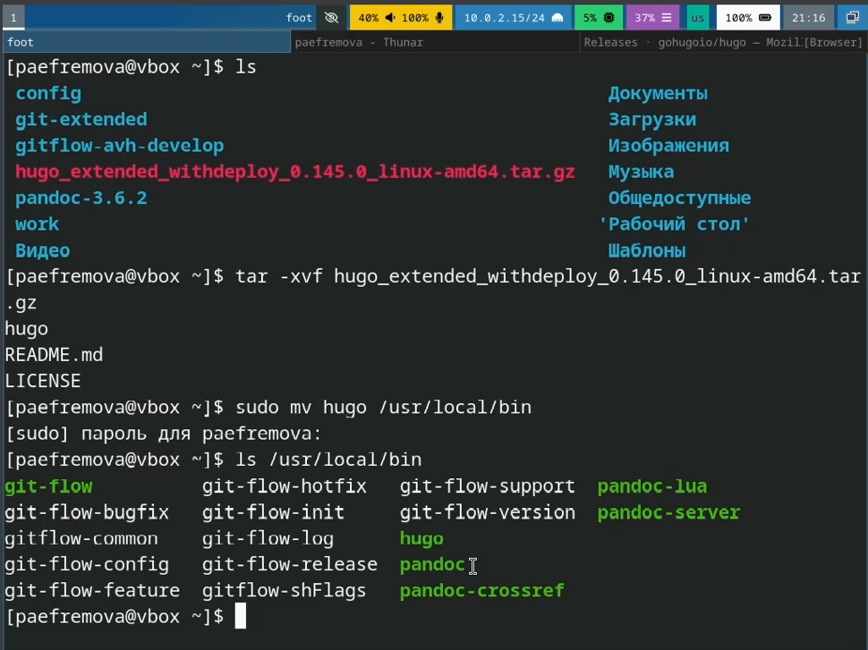
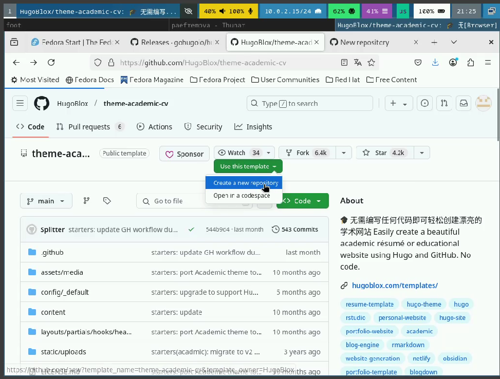
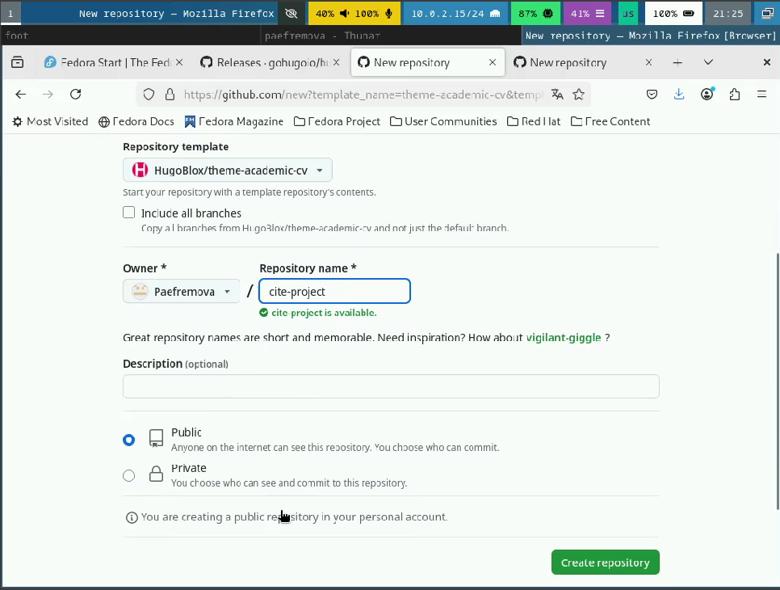
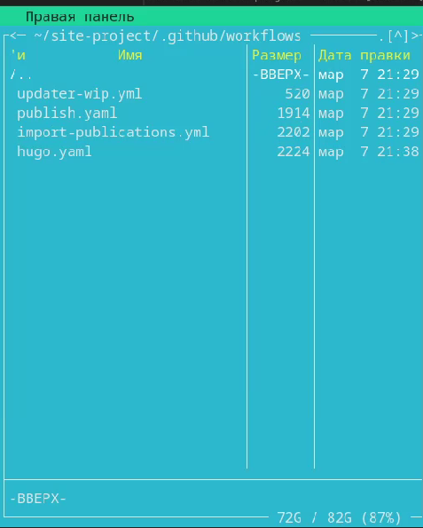
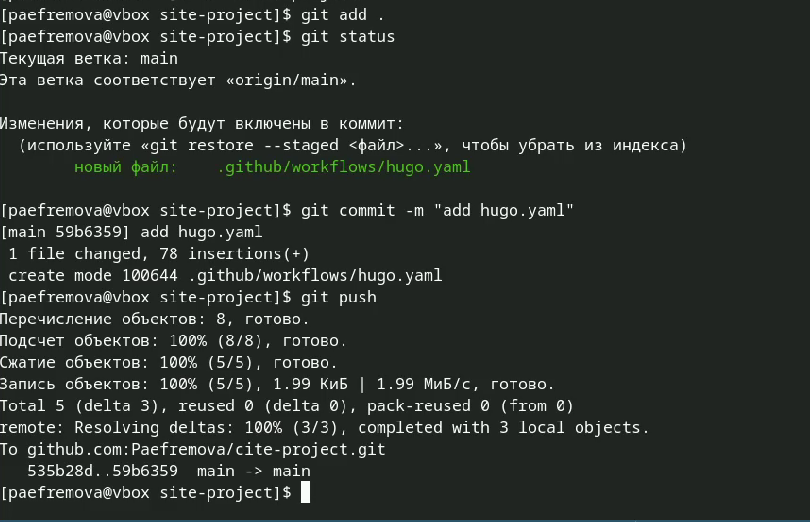
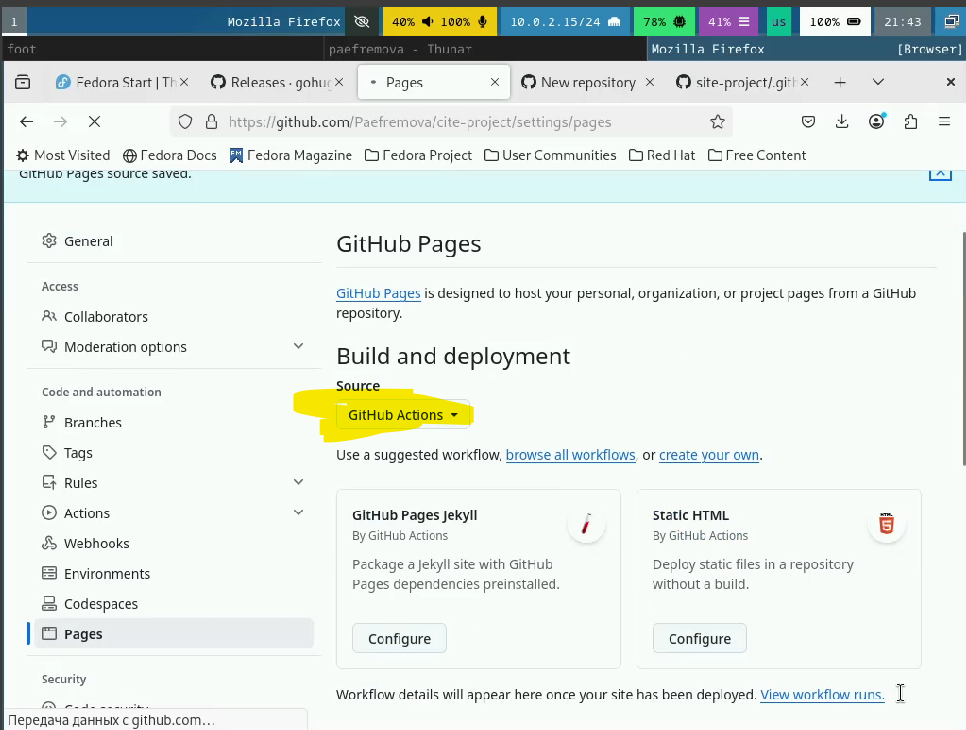
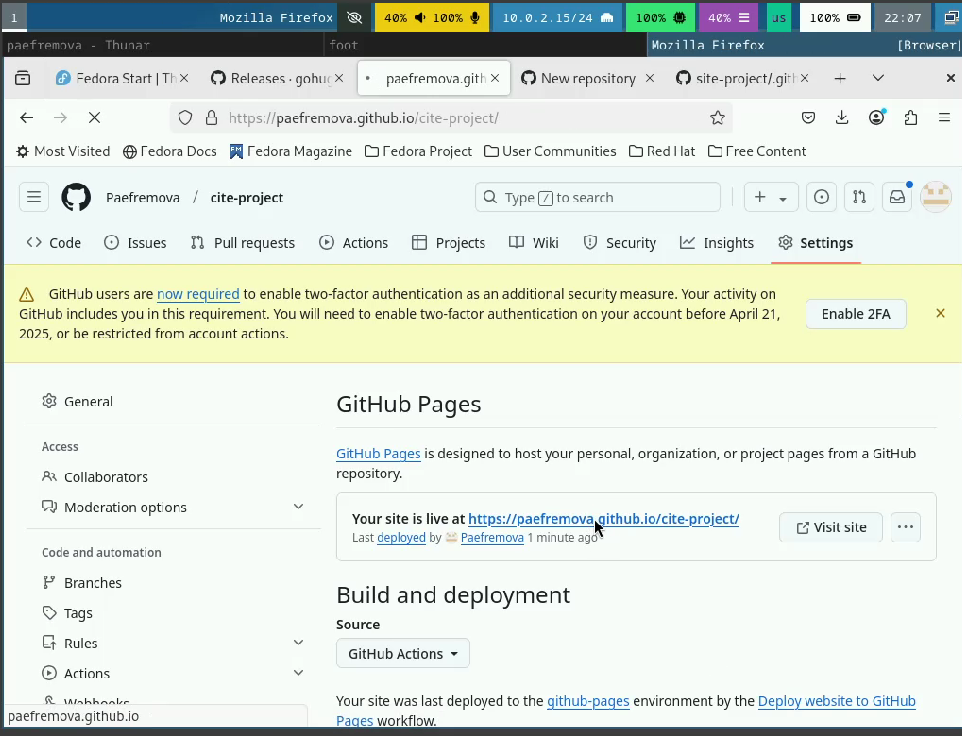
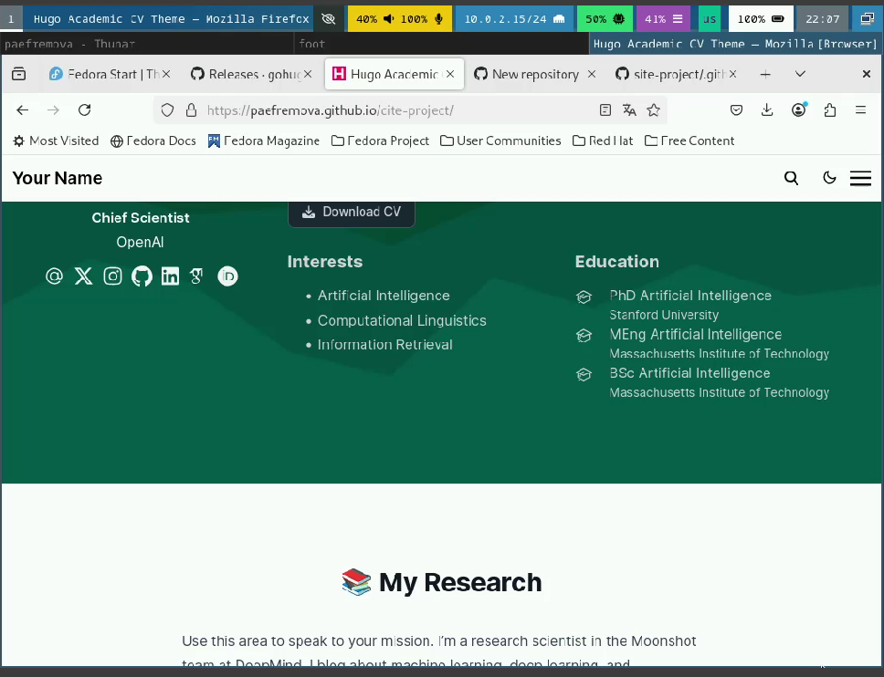

---
## Front matter
lang: ru-RU
title: Индивидуальный проект. Этап 1.
subtitle: Размещение на Github pages заготовки для персонального сайта.
author:
  - Ефремова Полина Александровна
institute:
  - Российский университет дружбы народов, Москва, Россия
 
date: 06 марта 2025

## i18n babel
babel-lang: russian
babel-otherlangs: english

## Formatting pdf
toc: false
toc-title: Содержание
slide_level: 2
aspectratio: 169
section-titles: true
theme: metropolis
header-includes:
 - \metroset{progressbar=frametitle,sectionpage=progressbar,numbering=fraction}
---

# Информация

## Докладчик

:::::::::::::: {.columns align=center}
::: {.column width="70%"}

  * Ефремова Полина Александровна 
  * студент группы НКАбд-02-24
  * ст.б №1132246726
  * Российский университет дружбы народов
  * polinaefeemova68890@gmail.com
  * <https://github.com/Paefremova/>

:::
::: {.column width="30%"}

:

:::
::::::::::::::

# Вводная часть

## Актуальность

- востребованность сайтов

- удобство в восприятии информации

- получение навыков создания сайта

## Объект и предмет исследования

- статический генератор сайта Hugo

## Цели и задачи

- Установить необходимое программное обеспечение.

- Скачать шаблон темы сайта.
    
- Разместить его на хостинге git.
    
- Установить параметр для URLs сайта.
 
-  Разместить заготовку сайта на Github pages.

## Материалы и методы

- установка ПО и исследование шаблона для сайта

- настройка Git

# Выполнение проекта

## 1. Установка hugo 

{#fig:001 width=70%}

## 2. Создаю новый репозиторий на основе шаблона, данного на ТУИС

{#fig:002 width=70%}

##

{#fig:003 width=70%}

## 3. Клонирую репозиторий в site-project 

{#fig:004 width=70%}

## 4. Добавляю в /site-project/.github/workflows/ файл hugo.yaml, найденный на сайте hugo 

{#fig:005 width=70%}

## 5. Загружаю изменения на GitHub 

{#fig:006 width=70%}

## 6. Перехожу на GitHub и в настройках Github pages меняю source на GitHub Actions 

{#fig:007 width=70%}

## 7. Перехожу по ссылке и вижу версию своего сайта 

{#fig:008 width=70%}

##

{#fig:009 width=70%}

## Выводы

В ходе выполнения проекта было установлено необходимое ПО, также были выполнены базовые настройки, которые помогут для 
дальнейшей работы по созданию сайта. 

## Список литературы{.unnumbered}

1. [Статья про hugo](https://habr.com/ru/articles/532738/)

2. [Этапы реализации проекта](https://esystem.rudn.ru/mod/page/view.php?id=1224358) 

3. [Техническая реализация проекта](https://esystem.rudn.ru/mod/page/view.php?id=1224359)

