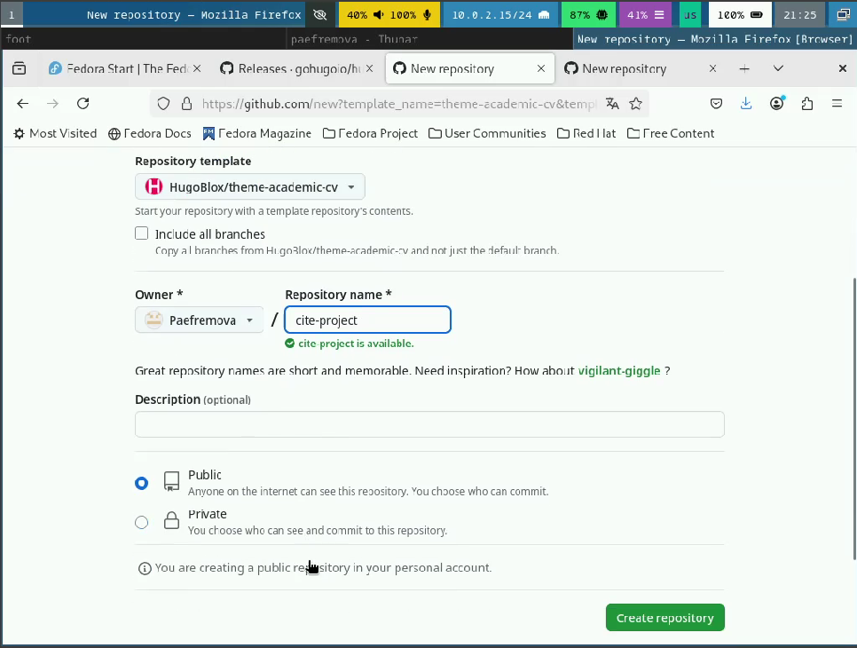

---
## Front matter
title: "Отчет о выполнении индивидуального проекта. Этап 1."
subtitle: "Архитектура компьютеров и операционные системы"
author: "Ефремова Полина Александровнав"

## Generic otions
lang: ru-RU
toc-title: "Содержание"

## Bibliography
bibliography: bib/cite.bib
csl: pandoc/csl/gost-r-7-0-5-2008-numeric.csl

## Pdf output format
toc: true # Table of contents
toc-depth: 2
lof: true # List of figures
lot: true # List of tables
fontsize: 12pt
linestretch: 1.5
papersize: a4
documentclass: scrreprt
## I18n polyglossia
polyglossia-lang:
  name: russian
  options:
	- spelling=modern
	- babelshorthands=true
polyglossia-otherlangs:
  name: english
## I18n babel
babel-lang: russian
babel-otherlangs: english
## Fonts
mainfont: IBM Plex Serif
romanfont: IBM Plex Serif
sansfont: IBM Plex Sans
monofont: IBM Plex Mono
mathfont: STIX Two Math
mainfontoptions: Ligatures=Common,Ligatures=TeX,Scale=0.94
romanfontoptions: Ligatures=Common,Ligatures=TeX,Scale=0.94
sansfontoptions: Ligatures=Common,Ligatures=TeX,Scale=MatchLowercase,Scale=0.94
monofontoptions: Scale=MatchLowercase,Scale=0.94,FakeStretch=0.9
mathfontoptions:
## Biblatex
biblatex: true
biblio-style: "gost-numeric"
biblatexoptions:
  - parentracker=true
  - backend=biber
  - hyperref=auto
  - language=auto
  - autolang=other*
  - citestyle=gost-numeric
## Pandoc-crossref LaTeX customization
figureTitle: "Рис."
tableTitle: "Таблица"
listingTitle: "Листинг"
lofTitle: "Список иллюстраций"
lotTitle: "Список таблиц"
lolTitle: "Листинги"
## Misc options
indent: true
header-includes:
  - \usepackage{indentfirst}
  - \usepackage{float} # keep figures where there are in the text
  - \floatplacement{figure}{H} # keep figures where there are in the text
---

# Цель работы

Размещение на Github pages заготовки для персонального сайта.

# Задание

- Установить необходимое программное обеспечение.

- Скачать шаблон темы сайта.
    
- Разместить его на хостинге git.
    
- Установить параметр для URLs сайта.
 
-  Разместить заготовку сайта на Github pages.

# Теоретическое введение

В 2020 практически весь мир фронтенда заполонили Javascript фреймворки. 
Только и слышно о React, Angular, Vue и иногда в далеких просторах можно услышать тихий шепот «Svelte». 
Разработчики умело используют эти инструменты для создания крутых продуктов, 
но есть и «динозавры» которые все еще предпочитают статику или jquery, а может их жизнь, вынуждает к этому или 
специфические задачи.Каждый день мир веб-разработки пополняется новыми технологиями, 
и сегодня речь пойдет о статических генераторах сайтов.

Статический генератор сайта — программа, которая из различных исходных файлов (картинок, шаблонов в разных форматах, 
текстовых файлов и т.п) генерирует статический HTML-сайт. 
Один из ярких представителей — Hugo. 
Разработчики позиционируют Hugo, как «самая быстрая в мире платформа для создания сайтов».

# Выполнение проекта

1. Установка hugo (рис. [-@fig:001]).

{#fig:001 width=70%}

2. Создаю новый репозиторий на основе шаблона, данного на ТУИС (рис. [-@fig:002]). (рис. [-@fig:003]).

{#fig:002 width=70%}

{#fig:003 width=70%}

3. Клонирую репозиторий в site-project (рис. [-@fig:004]).

{#fig:004 width=70%}

4. Добавляю в /site-project/.github/workflows/ файл hugo.yaml, найденный на сайте hugo (рис. [-@fig:005]).

{#fig:005 width=70%}

5. Загружаю изменения на GitHub (рис. [-@fig:006]).

{#fig:006 width=70%}

6. Перехожу на GitHub и в настройках Github pages меняю source на GitHub Actions (рис. [-@fig:007]).

{#fig:007 width=70%}

7. Перехожу по ссылке и вижу версию своего сайта (рис. [-@fig:008]). рис. [-@fig:009]).

{#fig:008 width=70%}

{#fig:009 width=70%}

# Выводы

В ходе выполнения проекта было установлено необходимое ПО, также были выполнены базовые настройки, которые помогут для 
дальнейшей работы по созданию сайта. 

# Список литературы{.unnumbered}

1. [Статься про hugo](https://habr.com/ru/articles/532738/)

2. [Этапы реализации проекта](https://esystem.rudn.ru/mod/page/view.php?id=1224358) 

3. [Техническая реализация проекта](https://esystem.rudn.ru/mod/page/view.php?id=1224359)

::: {#refs}
:::
