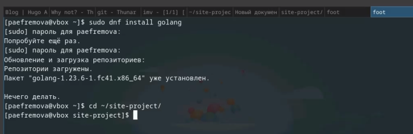
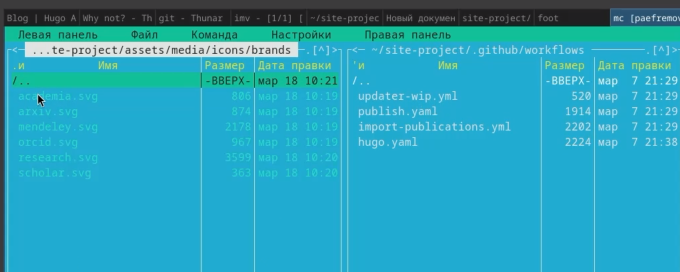
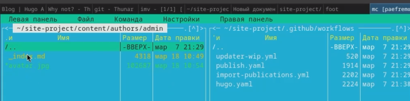
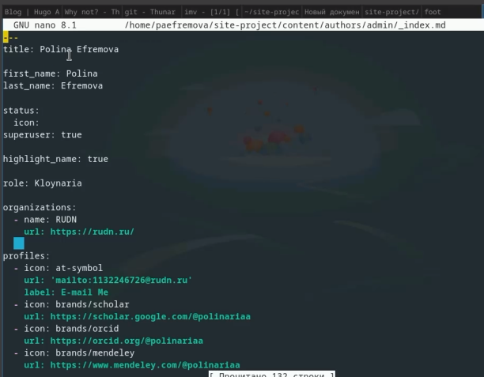
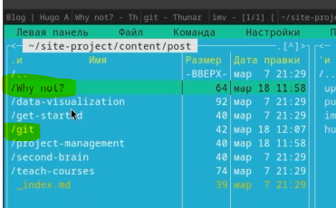
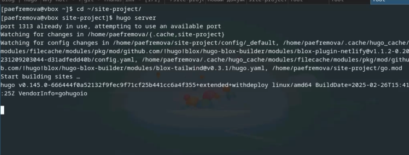
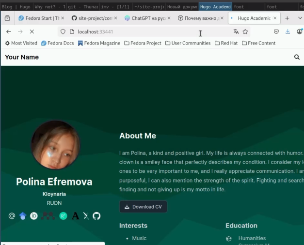
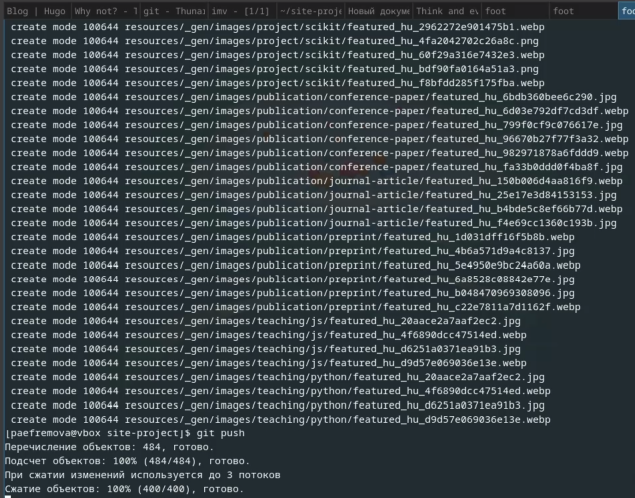
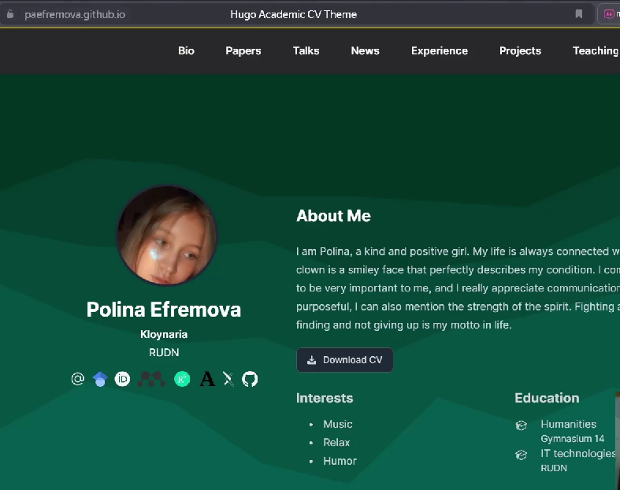
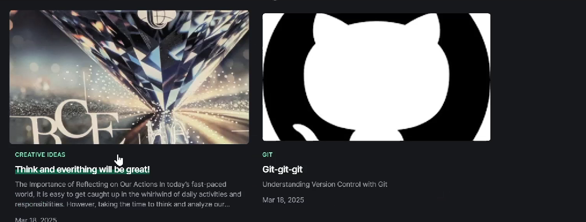

---
## Front matter
lang: ru-RU
title: Индивидуальный проект. Этап 2
subtitle: Персонализация
author:
  - Ефремова Полина Александровна
institute:
  - Российский университет дружбы народов, Москва, Россия
 
date: 06 марта 2025

## i18n babel
babel-lang: russian
babel-otherlangs: english

## Formatting pdf
toc: false
toc-title: Содержание
slide_level: 2
aspectratio: 169
section-titles: true
theme: metropolis
header-includes:
 - \metroset{progressbar=frametitle,sectionpage=progressbar,numbering=fraction}
---

# Информация

## Докладчик

:::::::::::::: {.columns align=center}
::: {.column width="70%"}

  * Ефремова Полина Александровна 
  * студент группы НКАбд-02-24
  * ст.б №1132246726
  * Российский университет дружбы народов
  * polinaefeemova68890@gmail.com
  * <https://github.com/Paefremova/>

:::
::: {.column width="30%"}

:

:::
::::::::::::::

# Вводная часть

## Актуальность

- много возможностей презентовать себя 

## Объект и предмет исследования

- сайт с помощью которого я рассказываю о себе 

## Цели и задачи

- добаить информацию о себе

- добавить интересы и информацию об образовании 

- опубликовать пост о прошедшей неделе

- опубликовать пост о Git

# Выполнение лабораторной работы

## 1. Устанавливаю golang 

{#fig:001 width=70%}

## 2. Добавляю в assets/media/icons/brands иконки 

{#fig:002 width=70%}

## 3. Меняю аватарку и информацию о себе 

{#fig:003 width=70%}

##

{#fig:004 width=70%}

## 4. Создаю два поста по заданным темам 

{#fig:005 width=70%}

## 5. Запускаю сайт 

{#fig:006 width=70%}

## 6. Проверяю изменения 

{#fig:007 width=70%}

## 7. Загружаю изменения на GitHub 

{#fig:008 width=70%}

## 8. Смотрю инофрмацию на своей странице 

{#fig:009 width=70%}

## 9. Сомтрю на загруженные посты 

{#fig:010 width=70%}

## Выводы

Сайт был отредактирован. Я добавила информацию о себе, также начала вести свой блог. 

## Список литературы{.unnumbered}

[Этапы реализации проекта](https://esystem.rudn.ru/mod/workshop/view.php?id=1224361)

