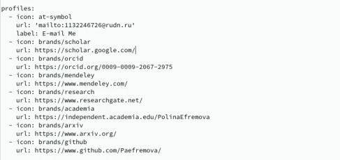
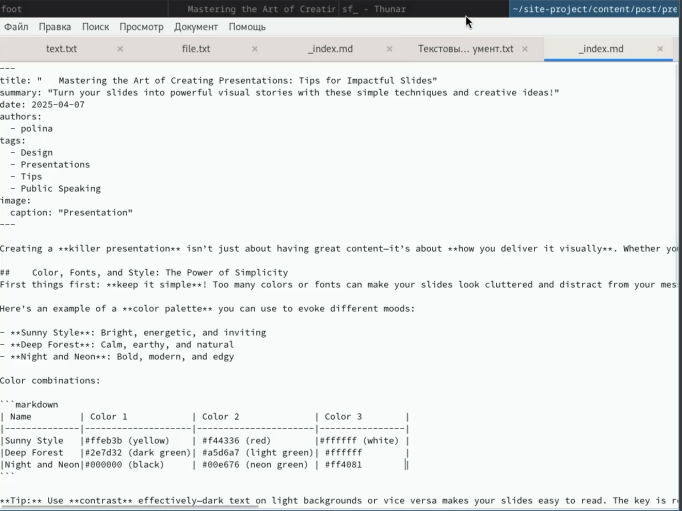
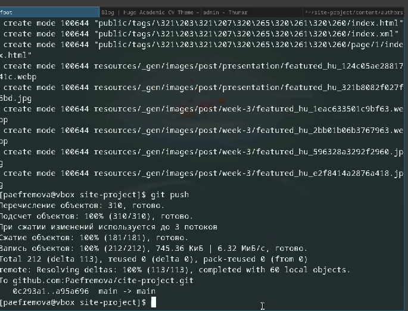
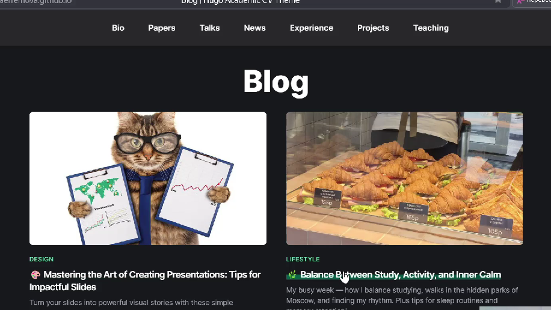
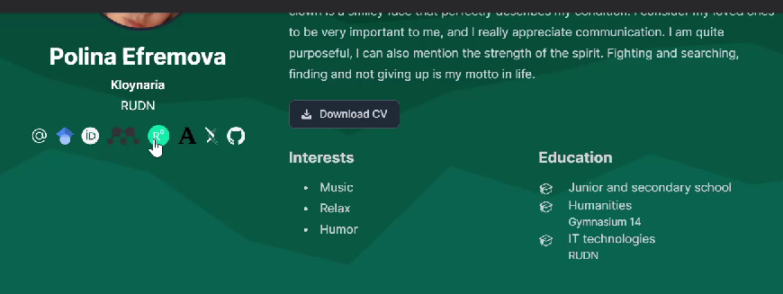

---
## Front matter
lang: ru-RU
title: Индивидуальный проект. Этап 4
subtitle: Персонализация
author:
  - Ефремова Полина Александровна
institute:
  - Российский университет дружбы народов, Москва, Россия
 
date: 9 апреля 2025

## i18n babel
babel-lang: russian
babel-otherlangs: english

## Formatting pdf
toc: false
toc-title: Содержание
slide_level: 2
aspectratio: 169
section-titles: true
theme: metropolis
header-includes:
 - \metroset{progressbar=frametitle,sectionpage=progressbar,numbering=fraction}
---

# Информация

## Докладчик

:::::::::::::: {.columns align=center}
::: {.column width="70%"}

  * Ефремова Полина Александровна 
  * студент группы НКАбд-02-24
  * ст.б №1132246726
  * Российский университет дружбы народов
  * polinaefeemova68890@gmail.com
  * <https://github.com/Paefremova/>

:::
::: {.column width="30%"}

:

:::
::::::::::::::

# Вводная часть

## Актуальность

- Важно донести результаты своих исследований до окружающих

## Объект и предмет исследования

- новые интернет-ресурсы 

## Цель работы

Создание сайта с информацией о себе, данный этап - прикрепление необходимых источников для обратной связи

## Задание

Добавить к сайту ссылки на научные и библиометрические ресурсы.

    1)Зарегистрироваться на соответствующих ресурсах и разместить на них ссылки на сайте:
        eLibrary : https://elibrary.ru/;
        Google Scholar : https://scholar.google.com/;
        ORCID : https://orcid.org/;
        Mendeley : https://www.mendeley.com/;
        ResearchGate : https://www.researchgate.net/;
        Academia.edu : https://www.academia.edu/;
        arXiv : https://arxiv.org/;
        github : https://github.com/.
    2) Сделать пост по прошедшей неделе.
    3) Добавить пост на тему по выбору:
        Оформление отчёта.
        Создание презентаций.
        Работа с библиографией.

## Выполнение лабораторной работы

1) Регистрируюсь на предложенных ресурсах и добавляю свои ссылки

{#fig:001 width=70%}

##

2) Добавляю необходимые посты

{#fig:002 width=70%}

##

3) Загружаю изменения на гитхаб. 

{#fig:004 width=70%}

##

4) Вижу добавленные посты 

{#fig:005 width=70%}

##

5) Вижу ссылки на ресурсы 

{#fig:006 width=70%}

## Выводы

Догрузила информацию на свой сайт, теперь чуть больше можно узнать о моих достижениях, интересах и навыках. 

